# ALL HIFZ DOCUMENTATION — COMBINED

> This file combines all 12 documentation files from docs/features/hifz/ word-for-word.

---

---

## === FILE: app-navigation.md ===

---

# App Navigation — Hifz-Centric Redesign

> **Decision:** Home becomes the Hifz Dashboard. Bottom nav gets revamped entirely.

---

## Dashboard (Home) — Layout

### For users WITH a profile:
```
┌──────────────────────────────────────┐
│  Assalamu Alaykum, Khalid  ☀️       │
│                                      │
│  ┌──────────────────────────────┐    │
│  │  TODAY'S PLAN                │    │
│  │  📖 Sabaq: Page 45          │    │
│  │  🔄 Sabqi: Pages 40-44      │    │
│  │  📚 Manzil: Juz 30 (6 pgs)  │    │
│  │  🃏 12 cards due             │    │
│  │                              │    │
│  │  [ Start Session ▶ ]        │    │
│  └──────────────────────────────┘    │
│                                      │
│  ┌──────────────────────────────┐    │
│  │  PROGRESS                    │    │
│  │  Juz 30: ████████░░ 82%     │    │
│  │  Pages memorized: 18/20     │    │
│  │  🔥 14 active days           │    │
│  └──────────────────────────────┘    │
│                                      │
│  ┌──────────────────────────────┐    │
│  │  WERD (Daily Reading)        │    │
│  │  3/5 pages · Continue →      │    │
│  └──────────────────────────────┘    │
│                                      │
│  ┌──────────────────────────────┐    │
│  │  ✨ Ayah of the Day          │    │
│  └──────────────────────────────┘    │
└──────────────────────────────────────┘
```

### For users WITHOUT a profile:
```
┌──────────────────────────────────────┐
│  Assalamu Alaykum ☀️                │
│                                      │
│  ┌──────────────────────────────┐    │
│  │  🌟 Start Your Hifz Journey  │    │
│  │                              │    │
│  │  Create a personalized       │    │
│  │  memorization plan designed  │    │
│  │  for your memory and pace.   │    │
│  │                              │    │
│  │  [ Create Profile → ]       │    │
│  └──────────────────────────────┘    │
│                                      │
│  ┌──────────────────────────────┐    │
│  │  WERD (Daily Reading)        │    │
│  │  3/5 pages · Continue →      │    │
│  └──────────────────────────────┘    │
│                                      │
│  ┌──────────────────────────────┐    │
│  │  ✨ Ayah of the Day          │    │
│  └──────────────────────────────┘    │
└──────────────────────────────────────┘
```

---

## Bottom Navigation — Final Decision

```
  Dashboard    Practice    Read    Listen    Profile
     🏠          🃏         📖      🎧        👤
```

| Tab | Content |
|---|---|
| **Dashboard** | Hifz dashboard, today's plan, progress, start session, CTA for profile creation |
| **Practice** | Flashcards + Mutashabihat drills. Dedicated tab for daily practice |
| **Read** | Reading screen + surah index. Merged reading experience |
| **Listen** | Audio library, reciter browsing, standalone listening |
| **Profile** | Profile management, settings, multiple profiles, reassessment. Name TBD (could be Settings/More) |

---

## Progress Visualization

### Primary: Pages (Juz-grouped)
```
  Juz 30 ███████████████████░ 95%
  Juz 29 ████████░░░░░░░░░░░░ 40%
  Juz 28 ░░░░░░░░░░░░░░░░░░░░  0%
```

### Detail: Page-level heatmap
Each cell = 1 page. Color = status.
```
  🟢 Memorized    🟡 Learning    🔵 Reviewing    ⚪ Not started
```

### Tab: Surah view
For context — which surahs have been covered.

---

## Starting Point

During profile creation, after the assessment:
```
┌──────────────────────────────────────┐
│  Where would you like to start?      │
│                                      │
│  Suggested:                          │
│  ⭐ Juz 30 (Juz 'Amma) — Most common│
│  ⭐ Surah Al-Baqarah — From start    │
│                                      │
│  Or pick your own:                   │
│  [ Browse Surahs ]  [ Pick a Page ]  │
└──────────────────────────────────────┘
```

Full freedom with gentle suggestions.


---

## === FILE: memory-profiles\profile-model.md ===

---

# 🧬 Memory Profile — Data Model & Architecture

> **Purpose:** Define what a memory profile is, what it stores, and how multiple profiles work.

---

## Overview

A **Memory Profile** is the user's personalized identity within the hifz program. It captures who they are as a learner, their framework parameters, their schedule, their default reciter, and all their progress data. One device can hold multiple profiles (household use case — parent, child, sibling).

---

## Profile Data Model

| Field | Type | Description |
|---|---|---|
| `id` | UUID | Unique profile identifier |
| `name` | String | Display name ("Khalid's Hifz", "أمي") |
| `avatarIndex` | int | Index into a set of pre-built avatar illustrations |
| `createdAt` | DateTime | When the profile was created |
| `ageGroup` | Enum | `child` (7-12), `teen` (13-17), `adult` (18+) |
| `encodingSpeed` | Enum | `fast`, `moderate`, `slow` — from assessment |
| `retentionStrength` | Enum | `strong`, `moderate`, `fragile` — from assessment |
| `learningPreference` | Enum | `visual`, `auditory`, `kinesthetic`, `repetition` |
| `dailyTimeMinutes` | int | Daily commitment (15–480) |
| `preferredTimeOfDay` | Enum | `fajr`, `morning`, `afternoon`, `evening`, `night` |
| `goal` | Enum | `fullQuran`, `specificJuz`, `specificSurahs` |
| `goalDetails` | List<int> | Juz numbers or Surah IDs if goal is specific |
| `defaultReciterId` | int | The reciter used across all hifz sessions |
| `defaultReciterSource` | Enum | `quranDotCom` or `mp3Quran` |
| `startingPage` | int | Page number where they begin memorization (1-604) |
| `startDate` | DateTime | When they began the program |
| `isActive` | bool | Whether this is the currently selected profile |

---

## Multi-Profile Architecture

### Storage
- All profiles stored in **SQLite** (not SharedPreferences)
- One `profiles` table with the fields above
- Related tables for progress data, session history, flashcard state, etc.
- Each is keyed to profile `id`

### UX
- Profile selector accessible from the hifz dashboard
- Quick switch without losing context
- Each profile has independent:
  - Memorization progress
  - Session history
  - Flashcard state
  - Review schedule
  - Streak data

### Profile Limit
- No hard limit, but UI optimized for 1-5 profiles
- "Add Profile" button always visible in the profile selector

---

## Default Reciter — Part of the Profile

The user selects a **default reciter** during profile setup (or later in profile settings). This reciter is used:

- In all hifz sessions (audio playback)
- As the default in the reading screen when opened from hifz context
- In the audio-first method (listen → recite)

**Why one reciter?** Research shows that memorizing with a single Qari builds stronger auditory memory — your brain associates the rhythm, melody, and pace of that specific reciter with the verses, creating stronger recall cues.

The user can always switch reciters temporarily, but the profile default is what loads automatically.

---

## How the Profile Shapes the Experience

The 2-axis assessment (encoding speed × retention strength) maps to practical plan parameters:

| Encoding Speed | Retention Strength | Daily New Load | Review Frequency | Method Suggestion |
|---|---|---|---|---|
| Fast | Strong | Higher (1-2 pages) | Standard intervals | Any parameter set works |
| Fast | Fragile | Moderate (0.5-1 page) | Aggressive SRS | Higher reps, audio-first emphasis |
| Slow | Strong | Lower (3-5 lines) | Relaxed intervals | Standard reps, visual emphasis |
| Slow | Fragile | Lowest (3-5 lines) | Most frequent SRS | Highest reps, smallest chunks |

These are **starting parameters** — the plan adapts based on actual performance after the first week (via user-accepted suggestions, never auto-adjusted).


---

## === FILE: memory-profiles\assessment-flow.md ===

---

# 🧭 Assessment Flow — Onboarding Wizard

> **Purpose:** Document the screen-by-screen profile creation and memory assessment experience.

---

## Design Principles

1. **Feels like a conversation, not an exam** — warm language, relatable scenarios
2. **No wrong answers** — every response is valid, there's no "bad memory type"
3. **Quick** — 7 screens, under 3 minutes total
4. **Beautiful** — each screen has an illustration or animation, matches app aesthetics
5. **Skip-friendly** — user can skip assessment and manually choose a method later

---

## Screen-by-Screen Flow

### Screen 1: Welcome 👋
**Header:** "Let's build your Hifz profile"  
**Subtext:** "A few quick questions to personalize your journey"

**Fields:**
- Name input (text field, placeholder: "What should we call you?")
- Avatar picker (horizontal scroll of 8-10 pre-built illustrations)

**CTA:** "Continue →"

---

### Screen 2: Age Group 🎂
**Header:** "How old are you?"  
**Subtext:** "This helps us tailor the experience"

**Options (large tap cards):**
- 🧒 Child (7-12)
- 🧑 Teen (13-17)
- 🧔 Adult (18+)

**Why we ask:** Children benefit from shorter sessions, more gamification, auditory-heavy methods. Adults benefit from meaning-based approaches and self-discipline tools.

---

### Screen 3: Learning Preference 📖
**Header:** "When you memorize something new, what helps most?"  
**Subtext:** "Pick the one that resonates most — no wrong answers!"

**Options (illustrated cards):**
- 👁️ **Looking and reading** — "I stare at the text until it sticks"
- 👂 **Listening** — "I listen to it over and over"
- ✍️ **Writing it down** — "Writing helps me remember"
- 🔄 **Repeating out loud** — "I just keep saying it until I know it"

**Maps to:** `learningPreference` → Influences method recommendation priority.

---

### Screen 4: Memorization Speed ⚡
**Header:** "Imagine memorizing a new page..."  
**Subtext:** "After 30 minutes of focused effort, how much would you typically remember?"

**Options (friendly, visual):**
- 🚀 **"Most of the page"** — I pick things up quickly → `fast`
- 📖 **"About half"** — I need a few sessions to finish a page → `moderate`
- 🐢 **"A few lines"** — I prefer to go slow and careful → `slow`

**Maps to:** `encodingSpeed`

---

### Screen 5: Retention ♻️
**Header:** "Think about something you memorized last month..."  
**Subtext:** "If someone asked you to recite it today, how would it go?"

**Options:**
- 💪 **"Pretty smoothly"** — It sticks with me once I learn it → `strong`
- 🤔 **"I'd need a quick refresh"** — Then it comes back → `moderate`
- 😅 **"I'd struggle"** — Things fade if I don't review regularly → `fragile`

**Maps to:** `retentionStrength`

---

### Screen 6: Schedule & Goal ⏰🎯
**Combined screen to reduce step count.**

**Top half — Time commitment:**
- "How much time daily?" — Slider from 15 min to 4+ hours
- "When do you prefer to study?" — Chips: Fajr / Morning / Afternoon / Evening

**Bottom half — Goal:**
- "What's your aim?" — Three large cards:
  - 📖 The entire Quran
  - 📑 Specific Juz (opens multi-select)
  - 📄 Specific Surahs (opens multi-select)

---

### Screen 7: Your Reciter 🎙️
**Header:** "Choose your Qari"  
**Subtext:** "Sticking with one reciter helps build stronger auditory memory"

- Same reciter list from the app's audio screen
- Filtered by user's rewaya preference (Hafs/Warsh)
- Shows a play button to preview each reciter
- Default pre-selected: Mishary al-Afasy (ID 7) or their existing preference

**CTA:** "Continue →"

---

### Screen 8: Starting Point 📍
**Header:** "Where would you like to start?"  
**Subtext:** "Pick any page or surah — you're in full control"

**Suggested options (based on assessment + goal):**
- ⭐ Juz 30 (Juz 'Amma) — "Most common starting point"
- ⭐ Surah Al-Baqarah — "Start from the beginning"

**Custom options:**
- 🔍 Browse Surahs (opens surah list picker)
- 📄 Pick a Page (opens page number input)

**💡 Suggestion note:** "Based on your profile, we suggest starting with Juz 'Amma"

**CTA:** "Continue →"

---

### Screen 9: Profile Summary ✨
**Header:** "Your Hifz Profile"

**Shows:**
- Name + avatar
- Memory profile visualization (a simple 2-axis graphic):
  - X-axis: Encoding Speed (slow → fast)
  - Y-axis: Retention Strength (fragile → strong)
  - User's dot placed on the chart
- Framework parameters summary:
  - Daily new material: "Half a page per day"
  - Target repetitions: "10 per section"
  - Time distribution: "25 min new / 15 min review / 15 min manzil"
- Starting point: "Juz 30, Page 582"
- Estimated timeline: "At 30 minutes/day, you could complete Juz Amma in ~6 weeks"

**CTAs:**
- ✅ "Start My Journey" (creates profile, navigates to hifz dashboard)
- ✏️ "Edit" (goes back to change any answer)

---

## Assessment Mapping Summary

| Question | Field | Options → Values |
|---|---|---|
| Learning preference | `learningPreference` | Visual / Auditory / Kinesthetic / Repetition |
| Memorization speed | `encodingSpeed` | Fast / Moderate / Slow |
| Retention ability | `retentionStrength` | Strong / Moderate / Fragile |

These three values combine to determine the **framework parameters** and **plan generation** (see [plan-generation.md](../methods-and-planning/plan-generation.md)).

---

## Adaptive Calibration (Post-Onboarding)

After the first 7 days, the app has real data from actual sessions:
- Actual pages/lines memorized per session
- Self-assessment scores from reviews
- Session completion rate

If the data diverges significantly from the assessment:
> "Based on your first week, it looks like you retain material better than expected! 🎉 Want to adjust your review schedule?"

This appears as a **suggestion on the dashboard** — the user accepts or dismisses. Nothing changes automatically.

---

## Returning to the Assessment

Users can **re-take the assessment** at any time from Profile Settings. This resets the framework parameters without losing progress data.


---

## === FILE: methods-and-planning\methods-overview.md ===

---

# The Hifz Framework

> **Key Decision:** There is no menu of "5 separate methods." There is **one unified framework** — Sabaq-Sabqi-Manzil — whose parameters adjust based on the user's profile. All traditional methods' strengths (repetition focus, audio emphasis, chunk sizing) are absorbed into framework parameters.

---

## The Framework: Sabaq → Sabqi → Manzil

Every hifz session follows the same three-phase structure:

```
┌─────────────────────────────────────────────────┐
│                  DAILY SESSION                  │
│                                                 │
│  ┌───────┐    ┌───────┐    ┌───────┐           │
│  │ SABAQ │ →  │ SABQI │ →  │MANZIL │           │
│  │ (New) │    │(Recent)│   │ (Old) │           │
│  └───────┘    └───────┘    └───────┘           │
│                                                 │
│  + Optional: Flashcards / Mutashabihat          │
└─────────────────────────────────────────────────┘
```

### Phase 1: Sabaq (New Memorization)
- The day's new material (assigned by the plan)
- User reads, listens, repeats until confident
- **Adjustable parameters:** chunk size (lines/half-page/full page), minimum repetitions, audio loops

### Phase 2: Sabqi (Recent Review)
- Review of the last 7-10 days of new material
- Prevents the "page collector" trap — forces consolidation
- **Adjustable parameters:** how many days back, how many pages per session

### Phase 3: Manzil (Long-term Review)
- Rotation of all previously completed juz
- Auto-rotates through completed juz; user can add/remove from rotation
- **Adjustable parameters:** pages per day, rotation speed

### Optional: Practice
- Flashcards from memorized content
- Mutashabihat drills when relevant pairs appear

---

## How the Profile Shapes the Framework

The user never picks a "method." Instead, their profile assessment automatically tunes the framework parameters:

| Profile Factor | Framework Parameter Affected |
|---|---|
| **Encoding Speed: Fast** | More new material per day (full page), fewer minimum reps |
| **Encoding Speed: Slow** | Less new material (3-5 lines), more minimum reps |
| **Retention: Strong** | Lighter sabqi (5 days back), lighter manzil |
| **Retention: Fragile** | Heavier sabqi (10 days back), heavier manzil, SRS flashcards emphasized |
| **Learning Pref: Visual** | Reading canvas emphasized, text highlight features |
| **Learning Pref: Auditory** | Audio loops, listen-first-then-read flow |
| **Learning Pref: Kinesthetic** | Physical Quran mode emphasized, writing prompts (future) |
| **Daily Time: 15 min** | Sabaq only, manzil every other day |
| **Daily Time: 30 min** | Sabaq + sabqi daily, manzil 3x/week |
| **Daily Time: 60+ min** | All three phases daily + flashcards |
| **Goal: Finish in 2 years** | Aggressive daily load |
| **Goal: Lifelong, no rush** | Gentle daily load, heavy review |

### The "Traditional Methods" — Absorbed Into Parameters

| Traditional Method | How It Maps to Framework Parameters |
|---|---|
| **Sabaq-Sabqi-Manzil** | Baseline framework — the default |
| **Ottoman Stacking** | Non-linear page groups, "stacking" chunks. Could be a future advanced option |
| **Repetition-Based (3x3)** | Higher repetition minimums, structured rep counting |
| **Audio-First** | Audio loop as first step in sabaq phase, listen before reading |
| **Mauritanian Luh** | ❌ Excluded — requires physical writing board |

---

## Session Modes

### 1. Physical Quran Mode (Default)
The user reads from their physical mushaf. The app serves as a **guide and timer**:
- Timer for each phase
- Repetition counter (tap to increment)
- Audio playback controls
- Step indicator (Sabaq → Sabqi → Manzil)
- "Done" button for self-assessment

### 2. Digital Reading Mode (Secondary)
The app's reading canvas shows the assigned content:
- Only the assigned page/lines are visible (session is scoped)
- Verse highlighting synced with audio
- Step/phase overlays
- Same controls as physical mode

### Switching
Default is physical. User can switch to digital from the session screen.

---

## Session Scoping

> **Critical rule:** Sessions show only assigned content, not the entire Quran.

| Session Type | What's Shown |
|---|---|
| Sabaq | Only the day's new page/lines |
| Sabqi | Only the last 7-10 days of material |
| Manzil | Only the assigned review juz pages |
| Free Review | User picks what to review |

### Override Options
- User can **override the day's plan** — manually select what to work on
- User can **mark work as done offline** — "I already did this" (individual sections or all at once)
- User can **skip any phase** — maximum flexibility

---

## Session Flexibility

| Action | Allowed? |
|---|---|
| Skip a phase | ✅ Yes |
| Increase time mid-session | ✅ Yes |
| Reduce time mid-session | ✅ Yes |
| End session early | ✅ Yes |
| Change assigned content | ✅ Yes — override plan |
| Mark as done offline | ✅ Yes — "I already did this" |

---

## Adaptive Calibration

After the first week, the system begins calibrating:

| Signal | Adjustment |
|---|---|
| User consistently finishes fast | Suggest: "Ready for more daily material?" |
| User skips sabqi often | Suggest: "Your review load might be too heavy. Reduce?" |
| User marks offline often | System learns this pattern, adjusts expectations |
| Flashcard pass rate < 50% | Suggest: "Slow down on new material, focus on review" |

> **Rule:** Always **suggest**, never auto-adjust. User accepts or dismisses.


---

## === FILE: methods-and-planning\session-design.md ===

---

# Session Design — Physical-First

> **Default mode:** Physical Quran. The app is a **guide, timer, and tracker** — not the reading surface.  
> **Secondary mode:** Digital reading. The app's reading canvas shows the assigned content.

---

## Session Flow

```
Start Session (Dashboard or Notification)
    │
    ├─ Confirm today's plan (or override)
    │
    ├─ Phase 1: SABAQ ──────┐
    │   New memorization     │  User controls:
    │                        │  - Timer
    ├─ Phase 2: SABQI ──────┤  - Rep counter
    │   Recent review        │  - Audio
    │                        │  - Skip/Done
    ├─ Phase 3: MANZIL ─────┤  - End early
    │   Long-term review     │
    │                        │
    ├─ Optional: FLASHCARDS ─┘
    │
    └─ Session Complete → Self-assessment → Dashboard
```

---

## Session Entry

| Entry Point | Behavior |
|---|---|
| Dashboard "Start Session" button | Opens session with today's plan pre-loaded |
| Notification tap | Opens directly into session |
| Override | User can change what to work on before starting |

---

## Pre-Session Screen

Before entering the session, the user sees:

```
┌────────────────────────────────────────┐
│  Today's Plan          [Edit Plan ✎]  │
│                                        │
│  📖 Sabaq:  Page 45 (Al-Baqarah)      │
│  🔄 Sabqi:  Pages 40-44 (last 5 days) │
│  📚 Manzil: Juz 30, Pages 582-587     │
│  🃏 Cards:  12 due                     │
│                                        │
│  ☑ I already did Sabaq offline         │
│  ☑ I already did Sabqi offline         │
│                                        │
│         [ Start Session ▶ ]            │
│                                        │
│  ⏱ Estimated time: 35 min             │
└────────────────────────────────────────┘
```

- Checkboxes for "I already did this" (individual or all)
- Edit plan button to override assigned content
- Estimated time based on profile

---

## Physical Quran Mode — Control Panel

The core session screen when using a physical Quran:

```
┌────────────────────────────────────────┐
│  SABAQ · Page 45 · Al-Baqarah         │
│  ─────────────────────────────────     │
│                                        │
│           ⏱  04:32                     │
│        Repetition: 7 / 10             │
│                                        │
│         ┌───────────┐                  │
│         │   + REP   │  ← Tap to count │
│         └───────────┘                  │
│                                        │
│  ◀◀   ▶ Play Audio   ▶▶   🔁          │
│                                        │
│  ─────────────────────────────────     │
│  Step 1 of 3   [ Skip → ]  [ Done ✓ ] │
└────────────────────────────────────────┘
```

### Elements
| Element | Purpose |
|---|---|
| Phase indicator | Shows current phase (Sabaq/Sabqi/Manzil) + content info |
| Timer | Counts up from start, or counts down from target time |
| Rep counter | Tap to increment. Shows current / minimum target |
| Audio controls | Play assigned reciter at correct position |
| Step indicator | Phase 1/2/3, skip button, done button |

---

## Digital Reading Mode

When user switches to digital, the reading canvas shows:

```
┌────────────────────────────────────────┐
│  SABAQ · Page 45                       │
│  ─────────────────────────             │
│                                        │
│  ┌──────────────────────────────┐      │
│  │                              │      │
│  │   [Arabic text of page 45]   │      │
│  │   Only assigned content      │      │
│  │   Verse highlighting active  │      │
│  │                              │      │
│  └──────────────────────────────┘      │
│                                        │
│  ⏱ 04:32  Rep: 7/10  ▶ Audio         │
│  Step 1/3   [ Skip ]   [ Done ✓ ]     │
└────────────────────────────────────────┘
```

- **Scoped:** Only assigned pages visible (no scrolling to unassigned content)
- **Reading canvas** re-used from existing reading screen
- **Floating controls** overlay at bottom (timer, rep counter, audio, nav)

---

## Self-Assessment (End of Phase)

After each phase, a quick self-check:

```
┌────────────────────────────────────────┐
│  How did your Sabaq go?                │
│                                        │
│  😊 Strong — I can recite fluently     │
│  😐 Okay — Some hesitation             │
│  😟 Weak — I need more time            │
│                                        │
│  [ Continue to Sabqi → ]               │
└────────────────────────────────────────┘
```

- 3 simple options, no friction
- Feeds into SRS and adaptive calibration
- Not graded — compassionate language

---

## Session Complete

```
┌────────────────────────────────────────┐
│  ✨ Session Complete                   │
│                                        │
│  📖 Sabaq:  Page 45 ✓                 │
│  🔄 Sabqi:  5 pages reviewed ✓        │
│  📚 Manzil: 6 pages reviewed ✓        │
│  🃏 Cards:  12/12 done ✓              │
│                                        │
│  ⏱ Total time: 38 min                 │
│  🔥 Day 14 active                      │
│                                        │
│  [ Back to Dashboard ]                 │
└────────────────────────────────────────┘
```

---

## Flexibility Rules

| Action | Supported? |
|---|---|
| Skip any phase | ✅ |
| Increase time mid-session | ✅ |
| Reduce time mid-session | ✅ |
| End session early | ✅ |
| Override today's content | ✅ |
| Mark phases as done offline | ✅ (from pre-session screen) |
| Reorder phases | ✅ (do tasks in any order) |
| Pause and resume later | ✅ (session saves state) |


---

## === FILE: methods-and-planning\plan-generation.md ===

---

# 📅 Plan Generation — Profile → Personalized Daily Plan

> **Purpose:** Define how the assessment results translate into a concrete memorization plan with scheduling, customization, and adaptive adjustment.

---

## The Plan Generation Pipeline

```
Assessment → Profile → Framework Parameters → Daily Schedule → Adaptive Calibration
```

---

## Step 1: Profile → Framework Parameters

The assessment tunes the Sabaq-Sabqi-Manzil framework:

| Encoding | Retention | Key Parameters |
|---|---|---|
| Fast | Strong | Large daily load (1 page), fewer reps (5-7), lighter sabqi |
| Fast | Fragile | Large daily load, more reps (10+), audio-first emphasis, heavy sabqi |
| Moderate | Strong | Medium load (0.5 page), standard reps (7-10) |
| Moderate | Moderate | Medium load, standard reps, balanced phases |
| Moderate | Fragile | Medium load, high reps (10-15), heavier manzil rotation |
| Slow | Strong | Small load (3-5 lines), fewer reps, page-visual emphasis |
| Slow | Moderate | Small load, standard reps, extra sabqi days |
| Slow | Fragile | Smallest load (2-3 lines), highest reps (15+), heaviest review |

No method selection — the framework parameters auto-adjust to the profile.

---

## Step 2: Profile + Time → Plan Parameters

### Daily New Material (Sabaq Load)

| Daily Time | Encoding Speed | Daily Sabaq |
|---|---|---|
| 15-30 min | Fast | 5-8 lines |
| 15-30 min | Moderate | 3-5 lines |
| 15-30 min | Slow | 2-3 lines |
| 1 hour | Fast | 0.5-1 page |
| 1 hour | Moderate | 5-8 lines |
| 1 hour | Slow | 3-5 lines |
| 2 hours | Fast | 1-2 pages |
| 2 hours | Moderate | 0.5-1 page |
| 2 hours | Slow | 5-8 lines |
| 4+ hours | Fast | 2-3 pages |
| 4+ hours | Moderate | 1-2 pages |
| 4+ hours | Slow | 0.5-1 page |

### Time Distribution Across Phases

| Daily Time | Sabaq | Sabqi | Manzil | Flashcards |
|---|---|---|---|---|
| 15 min | 8 min | 5 min | 2 min | — |
| 30 min | 15 min | 10 min | 5 min | — |
| 1 hour | 25 min | 15 min | 15 min | 5 min |
| 2 hours | 45 min | 30 min | 35 min | 10 min |
| 4 hours | 90 min | 45 min | 75 min | 30 min |

---

## Step 3: Goal → Timeline Calculation

### Full Quran (604 pages)

| Daily Load | Timeline |
|---|---|
| 3 lines/day | ~10 years |
| 5 lines/day | ~6 years |
| 0.5 page/day | ~3.5 years |
| 1 page/day | ~2 years |
| 2 pages/day | ~1 year |
| 3 pages/day | ~8 months |

### Specific Juz (20 pages each)

| Daily Load | Per Juz |
|---|---|
| 3 lines/day | ~4 months |
| 0.5 page/day | ~6 weeks |
| 1 page/day | ~3 weeks |

Timeline shown to user as: "At your pace, you'll reach your goal in approximately **X months**"

---

## Step 4: Daily Schedule Generation

Each day, the app generates a schedule:

```json
{
  "date": "2026-03-20",
  "profileId": "uuid",
  "sabaq": {
    "surahId": 2,
    "pageNumber": 3,
    "lineStart": 5,
    "lineEnd": 8,
    "targetMinutes": 25,
    "repetitionTarget": 10
  },
  "sabqi": [
    {
      "surahId": 1,
      "pageNumber": 1,
      "memorizedDate": "2026-03-17",
      "daysSince": 3,
      "targetMinutes": 15
    }
  ],
  "manzil": {
    "juzNumber": 30,
    "pagesAssigned": [582, 583, 584, 585, 586, 587],
    "rotationDay": 3,
    "targetMinutes": 15
  },
  "flashcards": {
    "enabled": true,
    "targetMinutes": 5,
    "deckSource": "memorized"
  }
}
```

---

## Customization Options

Users can always adjust:

| Setting | Range | Effect |
|---|---|---|
| Daily time | 15 min – 4+ hours | Adjusts all load calculations |
| Rest days | 0-3 per week | Extends timeline proportionally |
| Sabaq pace | Manual override | "I want to do 1 page/day no matter what" |
| Start point | Any page/surah | "I've already memorized Juz 30, start from Juz 29" |
| Manzil rotation | Add/remove juz | Control which completed juz are in the rotation |
| Flashcard time | 0-30 min/day | Adds practice time |

---

## Adaptive Adjustment

### Weekly Check (Automatic)
After each week, the system evaluates:
- Session completion rate (did they complete most days?)
- Self-assessment distribution (mostly strong? mostly weak?)
- Actual vs. planned material covered

### Adjustment Actions (Suggest, Never Auto-Adjust)

| Signal | Suggestion Shown |
|---|---|
| Completing consistently, mostly "Strong" | "🌟 You're doing great! Want to increase your daily load?" |
| Missing sessions frequently | "💡 Looks like things have been busy. Want to reduce your daily plan?" |
| Mostly "Weak" assessments | "💪 Consider reviewing more before adding new material. Reduce daily load?" |
| Ahead of schedule | "🎉 You're ahead! Keep going or take an extra review day?" |

> **Rule:** All adjustments are **suggestions**. The user accepts or dismisses. Nothing changes automatically.

### No Penalties
- Streak counts **total active days**, not consecutive
- Progress bar never goes backward
- Missed days silently absorbed — plan recalculates
- Returning after a gap triggers a gentle review-first session


---

## === FILE: practice-tools\flashcard-system.md ===

---

# 🃏 Flashcard System

> **Purpose:** Define the flashcard types, SRS engine, and integration rules for hifz review.

---

## Core Principle

> Flashcards test **already-memorized content** — they are a review and strengthening tool, not a primary memorization tool.

The flashcard system pulls from the user's memorized and in-review material, generates cards, and schedules them using spaced repetition.

---

## Card Types

### 1. 📝 Verse Completion
- **Shows:** First part of a verse with ending blanked (1-3 words hidden)
- **Action:** Tap to reveal, or select from multiple choice
- **Difficulty scaling:**
  - Easy: 1 word hidden
  - Medium: 2-3 words hidden
  - Hard: second half of verse hidden
- **Example:** "بسم الله الرحمن ___" → الرحيم

### 2. ⏭️ Next Verse
- **Shows:** A complete verse
- **Asks:** "What comes next?"
- **Action:** User recites mentally → tap to reveal next verse → rate recall
- **Tests:** Sequential memory — critical for unbroken recitation

### 3. ⏮️ Previous Verse
- **Shows:** A verse
- **Asks:** "What came before?"
- **Action:** Same as above but backward
- **Harder** than next-verse — trains reverse recall, helps when getting "stuck"

### 4. 🔗 Connect the Sequence
- **Shows:** 3-4 verses in scrambled order
- **Action:** User drags to reorder correctly
- **Tests:** Structural understanding of passage flow

### 5. 🔍 Surah Detective
- **Shows:** A verse (without surah/verse reference)
- **Asks:** "Which surah is this from?"
- **Action:** Multiple choice from 4 plausible surahs
- **Useful for:** Mutashabihat practice, general familiarity

### 6. ⚔️ Mutashabihat Duel
- **Shows:** Two nearly identical verses side by side, differences highlighted
- **Asks:** "Which one is from Surah X?"
- **Tests:** Discrimination between similar passages
- **See also:** [mutashabihat.md](./mutashabihat.md)

---

## SRS Engine

Uses a modified SM-2 algorithm (same engine that powers the daily review schedule):

| User Rating | Effect on Interval |
|---|---|
| 💪 **Strong** (instant recall) | Interval × 2.5 |
| 🤔 **OK** (recalled with effort) | Interval × 1.5 |
| 😅 **Weak** (struggled, got it eventually) | Interval remains same |
| ❌ **Forgot** (couldn't recall) | Reset to 1 day |

Cards start at interval = 1 day and grow from there.

---

## Deck Generation Rules

| Rule | Logic |
|---|---|
| **Source material** | Only verses the user has marked as memorized or in-review |
| **Priority** | Cards from recent reviews rated "Weak" or "Forgot" appear first |
| **Freshness** | Newly memorized material gets more cards initially |
| **Mutashabihat** | If user is studying a surah with known similar verses, add duel cards |
| **Daily target** | 5-10 minutes recommended, ~15-25 cards |
| **Never from un-memorized content** | No spoilers — only test what they've already learned |

---

## Suggested Daily Integration

| Time Budget | When |
|---|---|
| Standalone | 5-10 min anytime during the day — waiting, commute, before bed |
| Post-session | Optional 5 min after completing a sabqi or manzil session |
| Warm-up | Before a sabaq session, review yesterday's cards as a warm-up |


---

## === FILE: practice-tools\mutashabihat.md ===

---

# 📿 Mutashabihat — Similar Verses Practice

> **Purpose:** Define how the app handles mutashabihat (similar verses) — the biggest challenge for advanced memorizers.

---

## What Are Mutashabihat?

Verses across different surahs that are nearly identical except for:
- A single word change
- Different word order
- A different ending
- An extra or missing word

These are the **#1 cause** of mistakes during recitation for intermediate and advanced huffaz.

---

## Example

| Surah | Verse | Text |
|---|---|---|
| Al-Baqarah 2:58 | ادْخُلُوا هَٰذِهِ الْقَرْيَةَ فَكُلُوا | "Enter this town and eat" |
| Al-A'raf 7:161 | اسْكُنُوا هَٰذِهِ الْقَرْيَةَ وَكُلُوا | "Dwell in this town and eat" |

The difference: ادخلوا **فكلوا** vs. اسكنوا **وكلوا** — two small word changes that trip up even experienced memorizers.

---

## 4 Digital Practice Modes

### 1. 🔎 Spot the Difference
- Two similar verses shown side by side
- Differences highlighted with color (one color per occurrence)
- User studies the comparison
- Then one verse is hidden — user must recall the specific differences
- Most visual and accessible mode

### 2. 🔗 Context Anchoring
- Shows the similar verse with surrounding context (2 ayahs before and after)
- Teaches the user to rely on contextual flow rather than memorizing in isolation
- Optional tafsir snippets explaining *why* the wording differs (theological meaning)
- Helps build "logical anchors" — understanding *why* reduces confusion

### 3. 📋 Quick Quiz
- "This verse appears in two surahs."
- "In Surah Al-Baqarah, the word is ___. In Surah Al-A'raf, the word is ___."
- Fill-in-the-blank with tap-to-reveal
- Trains active recall of the specific distinguishing words

### 4. 📚 Mutashabihat Collection
- Browsable database of all known mutashabihat groups
- Each group:
  - Lists all occurrences (which surahs, which ayahs)
  - Highlights the exact differences in color
  - Shows frequency (how often each pair causes errors)
- User can mark groups as:
  - ✅ **Mastered** — won't appear frequently
  - 🔄 **Needs practice** — will appear in flashcard decks and quizzes
  - ❌ **Not yet studied** — excluded until they memorize those surahs

---

## Integration with Flashcards

When a user is reviewing a surah that contains known mutashabihat:
- Automatically inject **Mutashabihat Duel** cards into their flashcard deck
- Show a "⚠️ Similar verse alert" when they're about to memorize a new ayah that has a match elsewhere
- After marking a review as "Weak", check if it was a mutashabihat verse — if so, suggest focused practice

---

## Data Source

### 🎉 Ready-Made Dataset Found!

**[Waqar144/Quran_Mutashabihat_Data](https://github.com/Waqar144/Quran_Mutashabihat_Data)** — A curated JSON dataset of mutashabihat verse pairs:
- Based on the work of **Qari Idrees Al Asim** + practical hafiz experience
- **JSON format:** `{ "src": { "ayah": 3733 }, "muts": [{ "ayah": 3753 }, { "ayah": 3757 }] }`
- Includes a `ctx` flag for pairs needing surrounding context
- **Scripts written in Dart** (our language!) — can be run directly
- **Free license** — asks only for attribution
- Focus: most commonly confused pairs for huffaz (not exhaustive, but practical)

This solves our data source problem entirely for MVP. We can:
1. Import the JSON directly
2. Enrich with our category/difficulty metadata
3. Add verse text from our existing Quran API

### Enriched Format (Our Extension)
```
groupId: "mut_001"
src: { surahId: 2, ayahNumber: 58, text: "..." }
muts: [{ surahId: 7, ayahNumber: 161, text: "..." }]
uniqueWords: { src: ["ادخلوا", "فكلوا"], mut: ["اسكنوا", "وكلوا"] }
category: "word_swap"     // word_swap, word_order, extra_word, ending_change
difficulty: "medium"
needsContext: true         // from the ctx flag
```

### Categories of Mutashabihat

| Category | Description | Example |
|---|---|---|
| `word_swap` | One or more words replaced | ادخلوا ↔ اسكنوا |
| `word_order` | Same words, different sequence | — |
| `extra_word` | One version has an additional word | Incrementals pattern |
| `ending_change` | Same verse body, different ending | Different rhyme/فاصلة |
| `pronoun_change` | Masculine ↔ feminine, singular ↔ plural | — |

### Expansion
- Start with the most impactful 100 pairs
- Can be expanded from scholarly references over time
- Community contributions could be added later (users flag confusing pairs)
- Data stored locally in SQLite alongside hifz data

---

## When to Surface Mutashabihat Practice

| Trigger | Action |
|---|---|
| User memorizes a surah with known mutashabihat | Alert: "This surah has similar verses with Surah X" |
| User reviews and self-rates "Weak" on a mutashabihat ayah | Auto-add to flashcard deck, suggest focused practice |
| User completes daily session | Optional: "5-min mutashabihat practice?" |
| User explicitly opens Mutashabihat screen | Full browsable collection with all practice modes |


---

## === FILE: research\hifz-struggles.md ===

---

# 🚧 Hifz Struggles & Challenges — Research

> **Purpose:** Catalog the most common struggles people face when memorizing the Quran, along with solutions and practical strategies from real experiences. This informs which features the app should prioritize.  
> **Sources:** 60+ sources from NotebookLM deep research + 4 web searches (Reddit r/Hifdh, Tarteel, academies, research papers)

---

## The 10 Core Struggles

### 1. 🔗 The "Next Verse" Problem
**What it is:** The most universally reported struggle — knowing the current verse but blanking on what comes next. The "bridge" between verses breaks.

**Why it happens:**
- Verses memorized in isolation, not as flowing passages
- Over-reliance on visual memory of individual verses rather than sequential recall
- The brain encodes the content of a verse but not the *transition*

**Solutions people suggest:**
- **The Rabt (Link) Method:** The gold standard — repeat the *last word of Verse A and the first word of Verse B* together multiple times to weld the connection in your mind. Don't just attach single words; recite a *complete meaningful phrase* spanning the transition for a stronger cognitive link
- **The "Next Page" Rule:** A notorious blank-out point is at the end of a physical page. Fix this by *never stopping memorization at the last ayah of a page* — always memorize it alongside the first ayah of the next page so the brain seamlessly bridges the visual gap
- **Overlap technique:** Always memorize 2-3 verses as a group, never one alone. The ending of verse N and beginning of verse N+1 must be practiced as one unit
- **Recite from random starting points** within a surah, not always from the beginning
- **Audio method:** Listen to continuous recitation (not verse-by-verse) so transitions are absorbed naturally

**App opportunity:** 📱 *Next Verse flashcard*, *Connect the Sequence drag-and-drop*, Audio-First method with continuous playback

---

### 2. 🧠 Forgetting Previously Memorized Portions
**What it is:** The single most discussed problem — old memorization fading, sometimes material that was once "solid" becoming inaccessible.

**Why it happens:**
- Neglected review (sabqi/manzil) in favor of new memorization
- The "forgetting curve" — without revisiting, memory decays exponentially
- Life interruptions breaking the review routine

**Solutions people suggest:**
- **The 1:3 Ratio (from experienced huffaz):** For every 1 hour spent memorizing new verses, dedicate 3 hours to revision. Protecting what you already have is more vital than adding new verses
- **The Manzil system:** Recite 1 juz of older material every single day
- **Three-tiered daily structure:** Always split practice into Sabaq (new), Sabqi (last 7-10 days), Manzil (all older). Never memorize a new lesson without first reviewing the past week's work
- **Reciting in Salah:** Use newly memorized verses in daily prayers (especially Tahajjud) — forces active recall under pressure and anchors verses in long-term memory
- **Spaced repetition:** Counter the forgetting curve: review next day → 3 days → 7 days → 14 days → 30 days
- **Hadith motivation:** "Take care of the Quran, for by the One in Whose hand is the soul of Muhammad, it escapes faster than camels from their tethering ropes" (Bukhari & Muslim)

**App opportunity:** 📱 SRS engine, daily manzil assignments, automated review scheduling, "review before new" priority

---

### 3. 📿 Mutashabihat — Similar Verse Confusion
**What it is:** Confusing nearly identical verses that appear in different surahs. Even experienced huffaz struggle with this.

**Why it happens:**
- Natural interference between similar memory traces
- Insufficient study of the *specific differences*
- Passive learning (just re-reading) doesn't train discrimination

**Solutions people suggest:**
- **Study all occurrences together** — compare side by side
- **Create mnemonics** for the distinguishing word(s)
- **Understand the tafsir** — knowing *why* the wording differs creates a logical anchor
- **Page location awareness** — remember which page/position the verse is on
- **Dedicated mutashabihat books** exist (e.g., "Al-Mutashabihat fi al-Lafdhi" by scholars)

**App opportunity:** 📱 Mutashabihat Collection, Spot the Difference mode, Context Anchoring, Duel flashcards — already documented in `practice-tools/mutashabihat.md`

---

### 4. 😔 Loss of Motivation & Burnout
**What it is:** Enthusiasm fading over the months/years of the hifz journey. Feeling overwhelmed by the scale of the task.

**Why it happens:**
- Comparing yourself to others who progress faster
- Perfectionism — refusing to move on until a section is "perfect"
- Overworking without rest
- Not seeing tangible progress
- External pressures (work, family, school)

**Solutions people suggest:**
- **Realistic goals:** Small, achievable daily targets over ambitious unsustainable plans
- **Celebrate milestones:** Every juz, hizb, or surah completed is significant
- **Accountability partners:** Study groups, teachers, or hifz buddies
- **Focus on discipline, not motivation:** Motivation fluctuates; discipline shows up daily
- **Vary the routine:** Switch between new memorization, review, listening, and meaning study
- **Spiritual anchoring:** Renew intention regularly; make du'a for ease

**App opportunity:** 📱 Compassionate UX, milestone celebrations, streak tracking (total days, not consecutive), adjustable pace, motivational prompts

---

### 5. 🏃 Rushing New Memorization
**What it is:** Moving to new material before properly solidifying current material. "Page collectors" who accumulate pages but can't recite them without the mushaf.

**Why it happens:**
- Desire to "finish" as quickly as possible
- Social pressure from seeing others' progress
- Subconscious focus on the *next* ayah while still learning the current one
- Not having a structured system that enforces consolidation

**Solutions people suggest:**
- **The "golden rule":** Don't memorize new material until yesterday's material is recited perfectly from memory
- **Quality tests:** Recite to a teacher or partner before advancing
- **Repetition minimums:** Require X perfect recitations before moving on
- **The Mauritanian approach:** 500+ repetitions until it "recites itself"

**App opportunity:** 📱 Repetition counter with minimums, self-assessment gates before advancing, "not ready? review more" prompts

---

### 6. 🎤 Anxiety During Public Recitation / Testing
**What it is:** Being able to recite perfectly alone but freezing or fumbling when reciting to a teacher, leading prayer, or being tested.

**Why it happens:**
- Performance anxiety
- Fixed recitation pattern — always starting from the beginning, breaking when interrupted
- Not practicing recall from random starting points

**Solutions people suggest:**
- **Random starting point practice:** Ask someone to test you from arbitrary verse numbers
- **Recite during salah:** Regular prayer practice builds composure
- **Record yourself:** Listen back and identify weak points
- **Study with a partner:** Practice in low-pressure social settings

**App opportunity:** 📱 "Random verse" mode in flashcards, Surah Detective game

---

### 7. 📏 Difficulty with Long Surahs
**What it is:** Feeling overwhelmed when memorizing long surahs (Al-Baqarah = 286 verses, Ali Imran = 200 verses). The sheer scale feels impossible.

**Why it happens:**
- Psychological barrier — seeing "286 verses" feels insurmountable
- Long surahs have more mutashabihat within them
- Review load grows rapidly within a single surah

**Solutions people suggest:**
- **Break into rub' (quarters):** The Quran already has built-in quarter markers
- **Surah-within-a-surah:** Treat each thematic section as a mini-surah
- **Page-by-page approach:** Don't think about the surah — think about today's page
- **Thematic grouping:** Understand the surah's structure (story sections, legal sections, etc.)

**App opportunity:** 📱 Page-tracking granularity (not just surah), thematic section awareness, progress visualization within long surahs

---

### 8. 🕐 Balancing Hifz with Life
**What it is:** Finding time for daily memorization and review alongside work, school, family, and other commitments.

**Solutions people suggest:**
- **Early morning (post-Fajr):** Universal consensus that this is the best time for new memorization
- **Micro-sessions:** Even 10-15 minutes of review during commute, lunch, or waiting
- **Fixed time, not fixed amount:** "I will sit for 30 minutes" rather than "I will memorize 1 page"
- **Rest days:** It's okay to have 1-2 days/week for review only
- **Integration with salah:** Review memorized portions during prayer

**App opportunity:** 📱 Flexible daily plans, rest day support, micro-session mode (flashcards), time-based rather than portion-based goals

---

### 9. 🔙 Returning After a Long Break
**What it is:** Coming back to hifz after weeks, months, or even years away. The guilt and overwhelm of seeing how much was forgotten.

**Why it's painful:**
- Guilt and shame about "abandoning" the Quran
- Reviewing old material and realizing how much has faded
- Not knowing where to restart

**Solutions people suggest:**
- **No guilt — just start:** Everyone takes breaks; the reward is in returning
- **Review-only period:** Spend 1-2 weeks purely reviewing old material before adding new
- **Start where you're strong:** Begin reviewing from sections you know best, build confidence, then work toward weaker areas
- **Reduce expectations:** Start with a lighter load than before the break

**App opportunity:** 📱 Compassionate re-entry UX ("Welcome back!"), review-first sessions, adaptive plan recalculation, no streak penalties

---

### 10. 🗣️ Tajweed Mistakes Baked Into Memorization
**What it is:** Memorizing with incorrect pronunciation or tajweed, then having to "un-learn" bad habits.

**Why it happens:**
- Self-study without teacher correction
- Learning from low-quality audio sources
- Rushing memorization without focusing on articulation

**Solutions people suggest:**
- **Always learn from a teacher initially** — even if you self-study later
- **Listen to one high-quality reciter** and match their pronunciation exactly
- **Record yourself and compare** with the reciter's audio
- **Focus on makharij (articulation points)** before starting memorization

**App opportunity:** 📱 Default reciter in profile (one consistent audio source), audio comparison (future AI feature), slow-speed playback option

---

### 11. 🎯 Lack of Focus & Distractions
**What it is:** Wandering mind during memorization sessions, phone notifications, inability to concentrate deeply enough for encoding.

**Why it happens:**
- Digital age constant stimulation
- Trying to memorize at suboptimal times (tired, after meals)
- No structured session format

**Solutions people suggest:**
- **The Golden Hour (post-Fajr):** Universal consensus — the mind is freshest, quietest, most receptive right after Fajr prayer
- **Pomodoro Technique:** 25 minutes of intense, phone-free focus → 5 minute break → repeat
- **Tactile engagement:** For restless learners, use misbah (dhikr beads) to count repetitions, or write verses by hand — forces deep visual and kinesthetic focus
- **The Audio Mirror:** Record yourself reciting from memory, then play it back while following the mushaf — forces you to hear subtle errors you'd otherwise miss

**App opportunity:** 📱 Session timer with Pomodoro mode, do-not-disturb prompts, recording/playback feature (future), focus mode UI

---

## Summary: Top Struggles Mapped to App Features

| Struggle | Priority | App Feature |
|---|---|---|
| Next verse problem | 🔴 High | Next Verse flashcards, Rabt method, continuous audio |
| Forgetting old material | 🔴 High | SRS engine, 1:3 ratio enforcement, daily manzil |
| Mutashabihat confusion | 🔴 High | Dedicated mutashabihat practice modes |
| Loss of motivation | 🟡 Medium | Compassionate UX, milestones, adjustable pace |
| Rushing new memorization | 🟡 Medium | Repetition gates, self-assessment before advancing |
| Public recitation anxiety | 🟢 Lower | Random starting point tests, flashcard variety |
| Long surah overwhelm | 🟡 Medium | Page-level tracking, thematic sections |
| Balancing with life | 🟡 Medium | Flexible plans, micro-sessions, rest days |
| Returning after break | 🔴 High | Compassionate re-entry, adaptive plans |
| Tajweed mistakes | 🟡 Medium | Consistent reciter, slow playback, future AI |


---

## === FILE: research\context-aware-memorization.md ===

---

# 🌍 Context-Aware Memorization — Research

> **Purpose:** Explore how understanding meaning (tafsir), historical context (asbab al-nuzul), and Quranic stories can enhance memorization — and how to bring this into the app.  
> **Sources:** NotebookLM (120+ sources) + web search research on cognitive science, tafsir integration, and competitor apps

---

## The Core Idea

Traditional hifz focuses on *encoding the words*. Context-aware memorization adds: **Why was this revealed? What does it mean? What story does it tell? What theme is being addressed?**

Research consistently shows that **semantic memory** (meaning-based) produces stronger, more durable recall than pure rote memorization. By understanding *what* you're memorizing, you create richer neural connections — multiple pathways to the same memory.

> This isn't about speed. Some users will take 10-20 years memorizing the Quran this way. But they'll understand every word deeply, and it will be *theirs* in a way that rote memorization never achieves.

---

## Three Pillars of Context

### 1. 📖 Tafsir — Meaning & Interpretation

**What it is:** Scholarly commentary on the meaning of Quranic verses — linguistic analysis, theological significance, legal implications, and spiritual guidance.

**How it helps memorization:**
- Creates **semantic anchors** — you remember the *idea* behind the verse, not just the sound
- Connects verses to each other — understanding thematic flow aids sequential recall
- Makes mutashabihat easier — knowing *why* the wording differs creates logical hooks
- Transforms memorization from mechanical to meaningful

**Key tafsir resources:**
- **Tafsir Ibn Kathir** — classical, widely accessible, narrative-rich
- **Tafsir al-Sa'di** — concise, accessible for non-scholars
- **Tafsir al-Muyassar** — simplified modern tafsir
- **Quran.com translations** — available via API (multiple languages)

**Digital integration ideas:**
- Show a brief tafsir note alongside the verse being memorized
- "Why this verse?" — one-sentence meaning summary
- Toggle: "Show meaning" / "Hide meaning" during memorization session
- Language-aware: Arabic, English, French tafsir based on user's locale

---

### 2. 📜 Asbab al-Nuzul — Reasons for Revelation

**What it is:** The historical circumstances that occasioned the revelation of specific verses. Each verse (or group of verses) often has a story behind *why* it was revealed at that particular moment.

**How it helps memorization:**
- Creates **episodic memory** — you remember the *story* associated with the verse
- Stories are naturally easier to remember than isolated facts
- Provides emotional context — verses revealed during persecution, victory, grief, etc. carry emotional weight
- Anchors abstract theological concepts in concrete historical events

**Examples:**
- Al-Baqarah 2:195 ("spend in the way of Allah") — revealed when the Ansar wanted to focus on their farms instead of preparing for battle
- Al-Ma'idah 5:67 ("O Messenger, convey what has been revealed to you") — revealed when the Prophet hesitated to deliver a difficult message
- Surah Abasa — revealed when the Prophet frowned at a blind man who interrupted his conversation with Quraysh leaders

**Digital integration ideas:**
- "Story behind this verse" — expandable card during memorization session
- Brief narrative (2-3 sentences) per verse or verse group
- "Did you know?" prompts that surface asbab al-nuzul during review
- Mark verses that have known asbab al-nuzul with a special indicator

**Data source challenge:**
- Not all verses have recorded asbab al-nuzul (many were general guidance)
- Need a curated, scholarly-vetted database
- Could start with the most well-known 200-300 occasions
- Possible API source: some tafsir APIs include this data

---

### 3. 📚 Quranic Stories & Themes

**What it is:** The Quran contains narratives about prophets, historical communities, and moral lessons that span across surahs. Understanding the *narrative structure* helps users see the Quran as a coherent body, not disconnected pages.

**Categories of stories:**

| Category | Examples | Surahs |
|---|---|---|
| **Prophet stories** | Adam, Noah, Abraham, Moses, Jesus, Yusuf, Muhammad ﷺ | Yusuf, Maryam, Taha, Al-Anbiya, Al-Qasas |
| **Community stories** | People of Noah, 'Ad, Thamud, Pharaoh, People of Lut | Al-A'raf, Hud, Ash-Shu'ara |
| **Righteous individuals** | Maryam, Dhul-Qarnayn, People of the Cave, Luqman | Maryam, Al-Kahf, Luqman |
| **Events** | Battle of Badr, conquest of Mecca, night journey | Al-Anfal, Al-Fath, Al-Isra |

**Thematic structure of the Quran:**

| Section | Juz / Surahs | Dominant Themes |
|---|---|---|
| Early Medinan | Al-Baqarah, Ali Imran | Legal rulings, community building, Jewish/Christian dialogue |
| Meccan stories | Al-A'raf, Yunus, Hud, Yusuf | Prophet narratives, warnings to disbelievers |
| Late Meccan | Al-Isra through Al-Ahzab | Theology, prophethood, spiritual strengthening |
| Mid-Medinan | An-Nisa, Al-Ma'idah | Family law, social justice, interfaith relations |
| Short Meccan | Juz 30 (Juz Amma) | Resurrection, accountability, cosmic signs |

**How this helps memorization:**
- **Thematic grouping** reduces cognitive load — verses about the same topic cluster together in memory
- **Narrative flow** aids sequential recall — if you know the story is about Moses in Egypt, you anticipate what comes next
- **Cross-referencing** strengthens networks — "I know this story also appears in Surah X"
- **Emotional resonance** — stories create emotional engagement, which strengthens encoding

---

## Evidence: Does Understanding Meaning Actually Help?

**Yes.** The research is clear:

1. **Elaborative Encoding Theory (from NotebookLM):** Cognitive neuroscience confirms that forming meaningful relationships between new information (the verses) and existing knowledge (context/themes) strengthens neural activation and long-term memory. Reading tafsir and learning asbab al-nuzul provides "meaning-based anchors" — cognitive links that deepen emotional connection and prevent mental blocks.

2. **Semantic vs. Phonological Memory:** Semantic memory (meaning-based) engages the medial temporal cortex and prefrontal cortex more deeply than phonological (sound-based) memory alone. Understanding creates denser neural networks.

3. **Story Predictability Effect (from NotebookLM):** When learners familiarize themselves with a narrative (e.g., stories of Prophet Musa or Yusuf), they naturally anticipate the next event in the storyline. This makes it dramatically easier to remember what verse comes next — solving the #1 hifz struggle.

4. **Visual & Semantic Mapping:** Mentally visualizing scenes from Quranic stories (the Ababil birds, the parting of the sea) forms strong semantic networks. This transforms recitation from a purely auditory task into a contemplative, emotional, and intellectual exercise.

5. **Adult advantage:** Adults particularly benefit from meaning-based memorization. Children can memorize sounds rapidly, but adults' strength is in semantic and contextual processing.

6. **Mutashabihat:** Understanding *why* similar verses differ (theological reason, different context) is the single most effective way to distinguish them — more effective than mnemonics alone.

---

## How This Could Work in the App

### Approach 1: "Context Cards" During Sessions
- During a memorization session, optional expandable cards appear below the verse:
  - 📖 **Meaning** — Brief translation/tafsir
  - 📜 **Story** — Why this was revealed (asbab al-nuzul)
  - 🏛️ **Theme** — What subject this section addresses
- User can toggle: "Show context" / "Focus mode" (text only)
- Never forced — always optional

### Approach 2: "Story Mode" — Surah Introduction
- Before starting a new surah, show a thematic overview:
  - What this surah is about
  - When was it revealed (Meccan/Medinan)
  - Key themes and stories it contains
  - How many pages, verses, estimated time
- Sets the stage before memorization begins

### Approach 3: "Reflection Prompts" During Review
- During sabqi/manzil review, occasionally prompt:
  - "This verse is about [theme]. Do you remember why it was revealed?"
  - Not a test — a gentle reflection to engage deeper memory
  - Optional — can be turned off in settings

### Approach 4: Tafsir Browsing Screen
- Standalone screen where users can browse tafsir alongside the Quran text
- Linked from bookmarks, from the reading screen, from sessions
- Multiple tafsir sources selectable
- Not a memorization tool directly, but a study companion

---

## Competitor Analysis — Context-Aware Apps (from NotebookLM)

| App | Context Feature | Our Takeaway |
|---|---|---|
| **ITQAN** | Uses **mind-mapping** to link verses semantically to thematic topics | Mind-map visualization for surah themes could be powerful |
| **Mathani** | Integrates **translation learning alongside memorization** with gamified challenges | Combine meaning + memorization in the same flow, not separately |
| **Ayat (King Saud U.)** | Toggle between Arabic text, multiple translations, and detailed tafsir | Academic-grade tafsir integration is the gold standard |
| **Quran.com** | **Word-by-word translations** + exegesis alongside audio | We already use their API — word-by-word meaning is within reach |
| **Bayyinah TV** | In-depth tafsir, reflections, Arabic grammar breakdowns | Inspiration for "Study Mode" — not memorization but deep understanding |

---

## Data Sources for Implementation

| Data Need | Source Options |
|---|---|
| Verse translations | Quran.com API (multiple languages, already integrated) |
| Word-by-word meaning | Quran.com API (available, could add to reading canvas) |
| Brief tafsir | Tafsir al-Muyassar (available via Quran.com API), Tafsir al-Sa'di |
| Asbab al-nuzul | Would need a curated database — scholarly sources exist but need digitization |
| Surah themes | Manually curate from tafsir introductions (~114 entries) |
| Story index | Map which surahs contain which stories — manually curate |
| Meccan/Medinan | Standard scholarly data, widely available |

---

## Open Questions

1. **How deep should tafsir go?** Brief meaning only? Or full scholarly interpretation?
2. **Which tafsir sources?** One default + optional others?
3. **Asbab al-nuzul database** — Does a structured, digitized one exist, or do we need to build it?
4. **Language support** — Tafsir is most rich in Arabic. How do we serve English/French users?
5. **MVP scope** — Should context-aware features be in the initial release or a later phase?


---

## === FILE: user-flows.md ===

---

# 🧭 User Flows — Complete Journey Map

> **Purpose:** Map every user journey through the app — from first launch to daily practice to long-term mastery.

---

## Target Audience

### Primary Personas

| Persona | Description | Primary Goal | Daily Time |
|---|---|---|---|
| **The Beginner** | Never memorized before. Wants to start with Juz 'Amma or short surahs | Learn their first juz | 15-30 min |
| **The Returnee** | Memorized as a child, lost it. Wants to rebuild | Recover + expand | 30-60 min |
| **The Committed Student** | Active hifz student, possibly with a teacher | Complete the Quran | 1-4 hours |
| **The Casual Reader** | Uses the app for reading/listening, not memorization | Read Quran daily | N/A (no hifz) |
| **The Parent** | Sets up profiles for children on a household device | Guide children's hifz | Varies |

---

## Navigation Map

```
┌─────────────────────────────────────────────────────┐
│                    APP SHELL                         │
│                                                     │
│  ┌──────────┬──────────┬──────┬────────┬─────────┐  │
│  │Dashboard │ Practice │ Read │ Listen │ Profile │  │
│  │   🏠     │    🃏    │  📖  │   🎧   │   👤    │  │
│  └──────────┴──────────┴──────┴────────┴─────────┘  │
│       │           │         │       │        │      │
│       ▼           ▼         ▼       ▼        ▼      │
│   Today's     Flashcards  Reading  Audio   Settings │
│   Plan        Mutashabihat Screen  Library Profiles │
│   Progress    Stats       Surah    Reciter  Theme   │
│   Session               Index    Browse   About    │
│   Entry                                            │
└─────────────────────────────────────────────────────┘
```

---

## Flow 1: First Launch

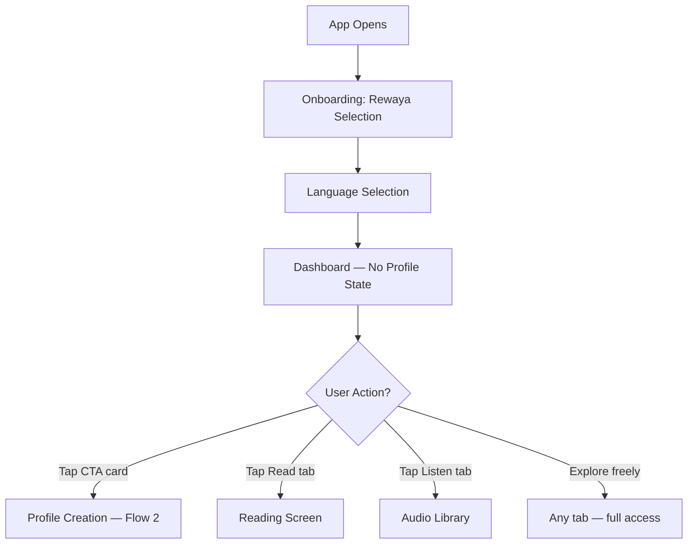

**Key decisions reflected:**
- Rewaya + language onboarding stays (existing feature)
- Profile creation is **optional** — user can explore first
- Dashboard shows CTA card inviting profile creation
- All app features accessible without a hifz profile

---

## Flow 2: Profile Creation (Assessment)

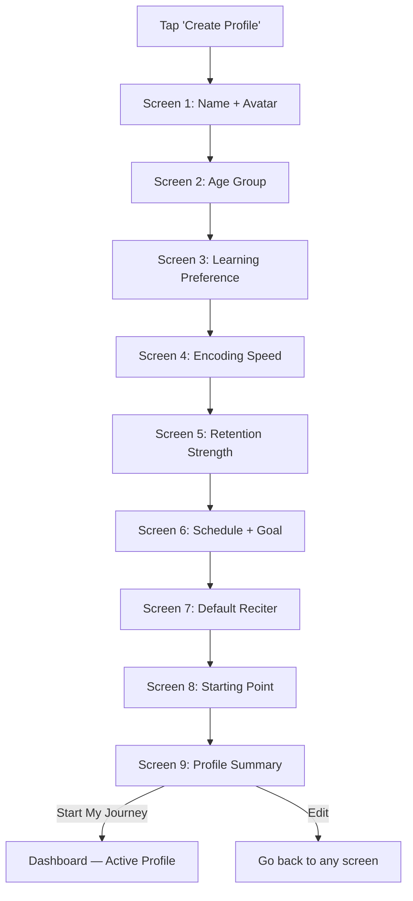

### Screen 8 (New): Starting Point
```
┌────────────────────────────────────────┐
│  Where would you like to start?        │
│                                        │
│  ⭐ Juz 30 (Juz 'Amma)               │
│     Most common starting point         │
│                                        │
│  ⭐ Surah Al-Baqarah                  │
│     Start from the beginning           │
│                                        │
│  🔍 Browse Surahs                      │
│  📄 Pick a Page                        │
│                                        │
│  💡 Based on your profile, we suggest  │
│     starting with Juz 'Amma            │
└────────────────────────────────────────┘
```

### Screen 9: Summary (Updated from assessment-flow.md)
Shows: name, avatar, 2-axis memory chart, framework parameters (daily load, reps, time distribution), estimated timeline, starting point.

**After creation:** Dashboard immediately shows today's first plan.

---

## Flow 3: Daily Dashboard Experience

The dashboard is the heart of the app. Every day, the user opens the app and sees:

### With Active Profile

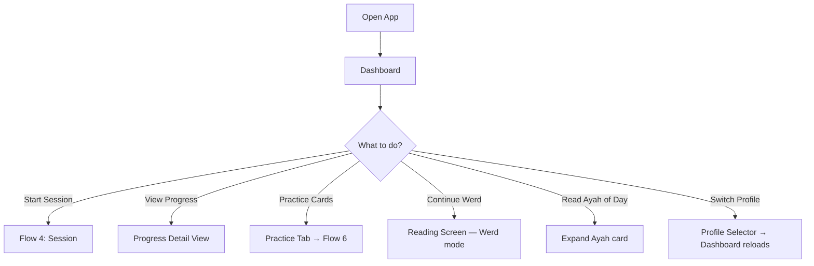

#### Dashboard Cards (Top to Bottom)

| Card | Content | Action |
|---|---|---|
| **Today's Plan** | Sabaq assignment, Sabqi pages, Manzil rotation, cards due | Tap → Pre-session screen |
| **Progress** | Current juz %, pages memorized count, active day streak | Tap → Progress detail |
| **Werd** | Daily reading goal progress (separate from hifz) | Tap → Reading screen |
| **Ayah of the Day** | Random verse with translation | Expandable |

### Without Profile (New User or Casual Reader)

| Card | Content |
|---|---|
| **CTA: Start Your Hifz Journey** | Invites profile creation, shows benefits |
| **Werd** | Daily reading goal |
| **Ayah of the Day** | Same as above |

---

## Flow 4: Hifz Session (Core Experience)

This is the most critical flow — what the user does every day.

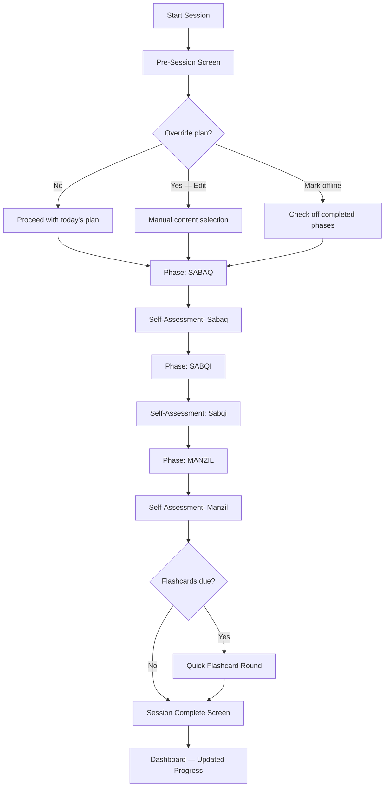

### Pre-Session Screen
```
┌────────────────────────────────────────┐
│  Today's Plan            Wed, Mar 20   │
│                          [Edit ✎]      │
│                                        │
│  📖 Sabaq:  Page 45 · Al-Baqarah      │
│     Lines 1-8 · ~25 min               │
│                                        │
│  🔄 Sabqi:  Pages 40-44               │
│     Last 5 days · ~15 min             │
│                                        │
│  📚 Manzil: Juz 30 · Pages 582-587   │
│     Rotation day 3/20 · ~15 min       │
│                                        │
│  🃏 Cards:  12 due · ~5 min           │
│                                        │
│  ── Already done offline? ──           │
│  ☐ Sabaq  ☐ Sabqi  ☐ Manzil  ☐ All   │
│                                        │
│  ⏱ Total estimated: ~60 min           │
│                                        │
│       [ Start Session ▶ ]              │
└────────────────────────────────────────┘
```

### During Session — Physical Quran Mode

```
┌────────────────────────────────────────┐
│  SABAQ · Page 45 · Al-Baqarah    1/3  │
│  ─────────────────────────────────     │
│                                        │
│                                        │
│            ⏱  12:32                    │
│                                        │
│        Repetition: 7 / 10             │
│                                        │
│        ┌─────────────┐                 │
│        │    + REP     │                │
│        └─────────────┘                 │
│                                        │
│                                        │
│  ◀◀  ▶ Play Audio  ▶▶   🔁 Loop       │
│  ─────────────────────────────────     │
│                                        │
│  [ ⏭ Skip ]            [ ✓ Done ]     │
└────────────────────────────────────────┘
```

**User actions during a phase:**
| Action | How |
|---|---|
| Count a repetition | Tap "+ REP" button |
| Play audio for assigned content | Tap play — audio starts at the correct verse |
| Loop audio | Toggle 🔁 — replays the assigned section |
| Skip this phase | Tap "Skip" — moves to next phase |
| Mark as done | Tap "Done" → triggers self-assessment |
| End session early | Back button / swipe → "End session?" confirmation |
| Increase time | Just keep going — timer counts up, no hard limit |
| Switch to digital | Menu option → reading canvas with assigned content |
| Change playback speed | Audio controls: 0.75x / 1.0x / 1.25x |

### Self-Assessment (After Each Phase)

```
┌────────────────────────────────────────┐
│                                        │
│  How did your Sabaq go?                │
│                                        │
│  ┌────────────────────────────┐        │
│  │  😊  Strong                │        │
│  │  I can recite fluently     │        │
│  └────────────────────────────┘        │
│  ┌────────────────────────────┐        │
│  │  😐  Okay                  │        │
│  │  Some hesitation           │        │
│  └────────────────────────────┘        │
│  ┌────────────────────────────┐        │
│  │  😟  Needs Work            │        │
│  │  I need more time          │        │
│  └────────────────────────────┘        │
│                                        │
│       [ Continue to Sabqi → ]          │
└────────────────────────────────────────┘
```

Feeds into: SRS intervals, adaptive calibration, flashcard priority.

### Session Complete

```
┌────────────────────────────────────────┐
│          ✨ Session Complete            │
│                                        │
│  📖 Sabaq:   Page 45 ✓  (Strong)      │
│  🔄 Sabqi:   5 pages ✓  (Okay)        │
│  📚 Manzil:  6 pages ✓  (Strong)      │
│  🃏 Cards:   12/12 ✓                   │
│                                        │
│  ⏱ Total: 58 min                      │
│  🔥 Day 14 active                      │
│                                        │
│  ┌──────────────────────────────┐      │
│  │  Tomorrow's preview:         │      │
│  │  📖 Page 46 · 🔄 Pages 41-45│      │
│  └──────────────────────────────┘      │
│                                        │
│       [ Back to Dashboard ]            │
└────────────────────────────────────────┘
```

---

## Flow 5: Plan Override

When the user's real day doesn't match the plan:

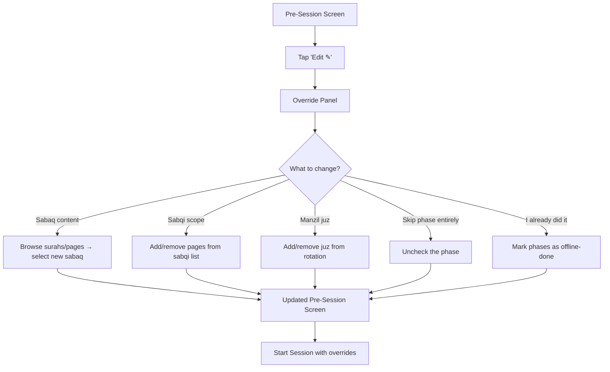

### "I Already Did This" Logic
- If Sabaq marked done → skip to Sabqi
- If Sabqi + Manzil marked done → show only Flashcards (or session complete)
- If all marked done → "Great! Everything's done for today. Want to do extra review?"
- System trusts the user — no verification

### Missed Days
When the user opens the app after missing a day (or multiple):
```
┌────────────────────────────────────────┐
│  Welcome back! 🌟                      │
│                                        │
│  You've been away for 3 days.          │
│  No worries — let's ease back in.      │
│                                        │
│  Today's suggestion:                   │
│  🔄 Review-only session (no new pages) │
│  📚 Manzil: Juz 30, 6 pages           │
│                                        │
│  [ Accept Suggestion ]                 │
│  [ Start Normal Plan Instead ]         │
│  [ Customize Today's Plan ]            │
└────────────────────────────────────────┘
```

- **Never guilt.** Language is warm and encouraging.
- Suggests review-only for 1-2 days before resuming new material
- User can override and continue normally

---

## Flow 6: Practice (Flashcards + Mutashabihat)

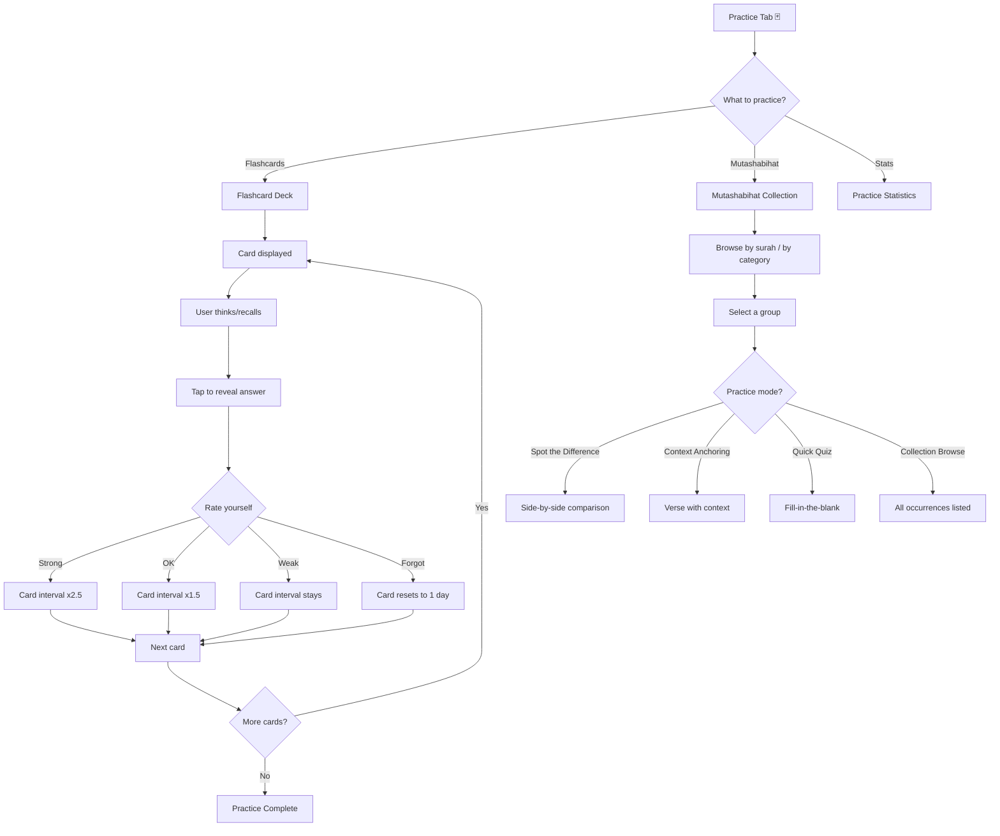

### Practice Tab Layout
```
┌────────────────────────────────────────┐
│  Practice                              │
│                                        │
│  ┌──────────────────────────────┐      │
│  │  🃏 Flashcards              │       │
│  │  12 cards due today          │      │
│  │  [ Start Review → ]          │      │
│  └──────────────────────────────┘      │
│                                        │
│  ┌──────────────────────────────┐      │
│  │  📿 Mutashabihat            │       │
│  │  3 groups need practice      │      │
│  │  [ Practice → ]              │      │
│  └──────────────────────────────┘      │
│                                        │
│  ── Practice Statistics ──             │
│  Cards reviewed this week: 84          │
│  Accuracy: 78%                         │
│  Streak: 5 days                        │
│                                        │
│  ── Card Type Breakdown ──             │
│  Next Verse:      ████████░ 82%        │
│  Verse Completion: ██████░░ 72%        │
│  Mutashabihat:     █████░░░ 65%        │
└────────────────────────────────────────┘
```

---

## Flow 7: Progress Review

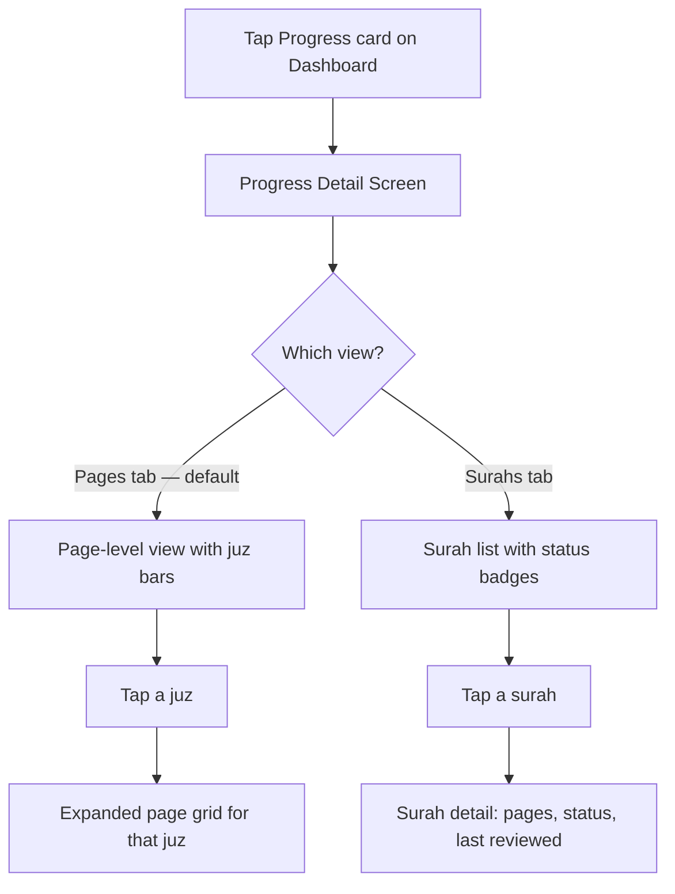

### Pages View (Default)
```
┌────────────────────────────────────────┐
│  Progress            [Pages] [Surahs]  │
│                                        │
│  Overall: 38/604 pages (6.3%)          │
│  ████░░░░░░░░░░░░░░░░░░░░░░░░░░░░     │
│                                        │
│  Juz 30  ████████████████████░  95%    │
│  Juz 29  ████████░░░░░░░░░░░░  40%    │
│  Juz 28  ░░░░░░░░░░░░░░░░░░░░   0%   │
│          ⋮                             │
│  Juz 1   ░░░░░░░░░░░░░░░░░░░░   0%   │
│                                        │
│  ── Quick Stats ──                     │
│  🔥 Active days: 14                    │
│  📅 Started: Feb 20, 2026             │
│  📈 Pace: 1.3 pages/week              │
│  🎯 Est. completion: Dec 2028         │
└────────────────────────────────────────┘
```

### Page Grid (Tap a Juz)
```
  🟢🟢🟢🟢🟢🟢🟢🟢🟢🟢
  🟢🟢🟢🟢🟢🟡🟡🟡🔵⚪
  ⚪⚪⚪⚪⚪⚪⚪⚪⚪⚪

  🟢 Memorized  🟡 Learning  🔵 Reviewing  ⚪ Not started
```

---

## Flow 8: Reading (Non-Hifz)

The Read tab works independently of the hifz program:

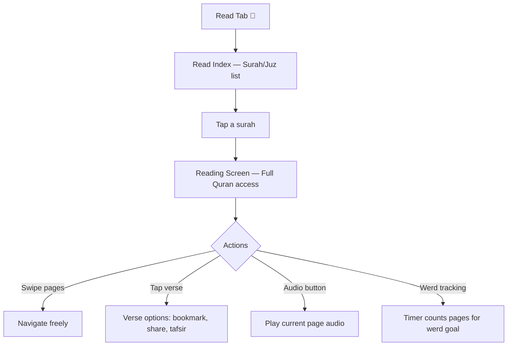

- **No restrictions** — full Quran access (unlike sessions which are scoped)
- Werd tracking continues to work as it does today
- Bookmarks, theme settings, all existing features preserved
- Audio playback available per page/chapter

---

## Flow 9: Listening (Non-Hifz)

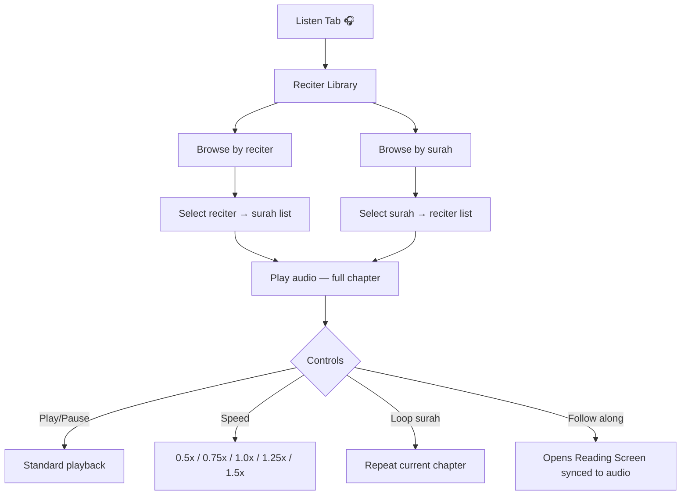

---

## Flow 10: Adaptive Suggestions

After the first week, the system begins observing patterns:

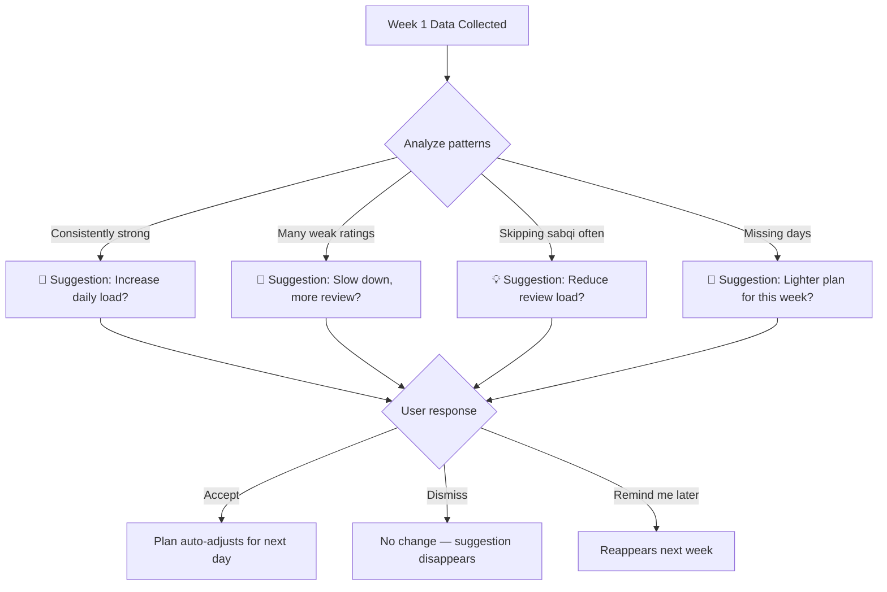

**Delivery:** Suggestions appear as a card on the dashboard, NOT as a modal/popup. Non-intrusive.

---

## Flow 11: Multiple Profiles

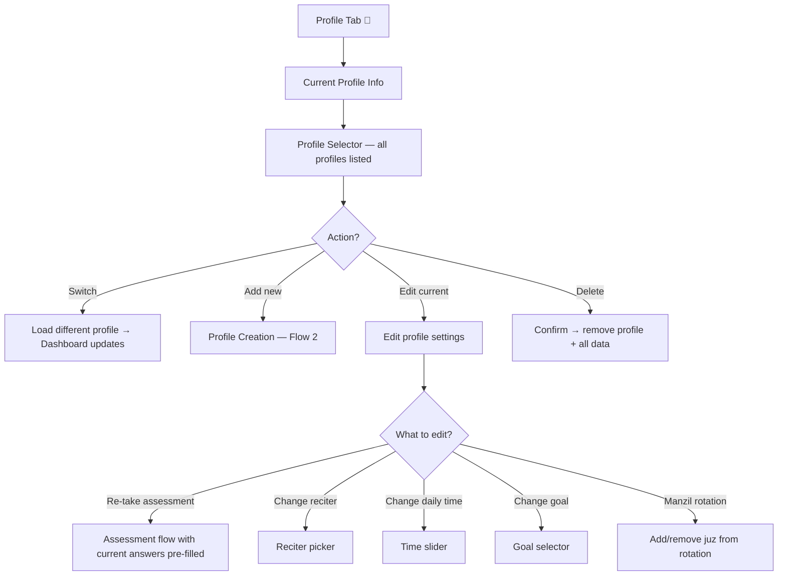

---

## Flow 12: Notification-Driven Session

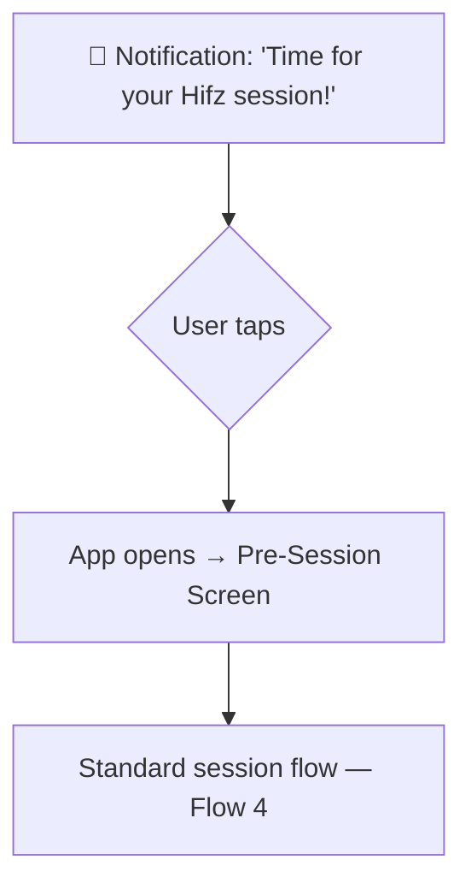

Notification preferences set in Profile:
- Time of day (matches `preferredTimeOfDay` from assessment)
- User can snooze or dismiss
- Smart: if session already completed today, no notification

---

## Daily Practice Rhythm

A typical day for the committed user:

```
6:00 AM  📱 Notification: "Time for Hifz"
6:05 AM  🏠 Open Dashboard → see today's plan
6:06 AM  📖 Start Session → Sabaq (25 min)
6:31 AM  🔄 Sabqi phase (15 min)
6:46 AM  📚 Manzil phase (15 min)
7:01 AM  🃏 Quick flashcards (5 min)
7:06 AM  ✨ Session Complete → Dashboard updated

... During the day ...

12:30 PM 🃏 Practice tab → review 10 more cards (commute/lunch)
9:00 PM  📖 Werd: read 3 pages casually (separate from hifz)
```

---

## Edge Cases

| Scenario | Handling |
|---|---|
| User memorized a surah before using the app | Profile setup → pick starting point; or mark pages as memorized manually in Progress view |
| User's teacher assigns different content | Override plan for the day — full flexibility |
| User wants to review a surah not in their manzil | Override → add it to today's session |
| User finishes the Quran | 🎉 Celebration screen → Plan shifts to full-time review mode |
| User reinstalls the app | SQLite data on device; future: cloud sync |
| Ramadan mode | Heavier manzil rotation (review entire Quran during Ramadan), lighter sabaq |
| Two profiles want different reciters | Each profile has independent reciter setting |
| Child profile | Shorter sessions, simpler language, more 🎉 celebrations |


---

## === FILE: roadmap.md ===

---

# Hifz Program — Full Roadmap

> **Philosophy:** Plan the entire journey — MVP through final product. Every phase's architecture must accommodate later additions.

---

## Phase 1 — Foundation (MVP Core)

The bones of the framework + dashboard.

### Features
- [ ] **Memory Profile** — assessment flow (8 screens), multi-profile support
- [ ] **Dashboard (Home)** — today's plan, progress overview, CTA for profile creation
- [ ] **Framework Engine** — Sabaq/Sabqi/Manzil daily plan generation
- [ ] **Session Screen** — physical Quran mode (control panel: timer, rep counter, audio, step nav)
- [ ] **Self-Assessment** — 3-option post-phase rating (strong/okay/weak)
- [ ] **Progress Tracking** — pages memorized, juz progress indicators
- [ ] **SQLite Migration** — move from SharedPreferences to SQLite for all hifz data

### Data Models
- `MemoryProfile`, `HifzPlan`, `DailySession`, `SessionPhase`, `ProgressRecord`

### Architecture Decisions
- Session scoping (restrict content to assigned material)
- Auto-rotating manzil with user control
- Offline marking (mark all / individual phases)

---

## Phase 2 — Practice Tools

Flashcards + mutashabihat to strengthen retention.

### Features
- [ ] **Flashcard System** — all 6 card types (Verse Completion, Next Verse, Previous Verse, Connect Sequence, Surah Detective, Mutashabihat Duel)
- [ ] **SRS Engine** — SM-2 based spacing algorithm
- [ ] **Mutashabihat Practice** — Spot the Difference, Context Anchoring, Quick Quiz, Collection
- [ ] **Mutashabihat Data** — import `Waqar144/Quran_Mutashabihat_Data` JSON dataset
- [ ] **Dashboard Integration** — "X cards due" indicator, flashcard entry point

### Bottom Nav Candidate
- Add Flashcards/Practice as a tab

---

## Phase 3 — Context-Aware Content

Understanding aids memorization.

### Features
- [ ] **Translation Overlay** — show verse translation during sessions
- [ ] **Brief Tafsir** — Tafsir al-Muyassar (via Quran.com API)
- [ ] **Detailed Tafsir** — scholar-level tafsir behind "More" button
- [ ] **Asbab al-Nuzul** — import `mostafaahmed97/asbab-al-nuzul-dataset` (sample for UX)
- [ ] **Surah Introduction** — thematic overview before starting a new surah (Meccan/Medinan, themes, key stories)

### Datasets
- Quran.com API: translations + Tafsir al-Muyassar
- Asbab al-Nuzul: JSON per surah (Arabic, authenticated hadith source)

---

## Phase 4 — Digital Session Mode

Reading in-app during sessions.

### Features
- [ ] **Scoped Reading Canvas** — only assigned content visible
- [ ] **Session Overlays** — floating timer, rep counter, phase indicator on reading screen
- [ ] **Mode Switching** — toggle physical ↔ digital mid-session
- [ ] **Verse-level Audio Sync** — highlight active verse during playback

---

## Phase 5 — Adaptive Intelligence

Smart plan adjustments based on real performance.

### Features
- [ ] **Adaptive Calibration** — detect patterns, suggest plan adjustments
- [ ] **Smart Notifications** — "You haven't reviewed Juz 30 in 5 days"
- [ ] **Struggle Detection** — identify consistently weak sections, auto-add flashcards
- [ ] **Performance Analytics** — weekly/monthly hifz reports (pages memorized, retention rate, streaks)

---

## Phase 6 — Social & Accountability

Community-driven motivation.

### Features
- [ ] **Accountability Partners** — invite friend to see your streaks
- [ ] **Teacher Mode** — share progress with a teacher/mentor
- [ ] **Community Milestones** — celebrate juz/khatm completions
- [ ] **Leaderboards** (optional, opt-in) — for competitive motivation

---

## Phase 7 — Advanced Features

Long-term vision features.

### Features
- [ ] **AI-Powered Assessment** — analyze recitation quality (future)
- [ ] **Full Multi-Tafsir** — multiple scholarly tafsir sources, user picks
- [ ] **Full Asbab al-Nuzul** — complete database with English translation
- [ ] **Story Mode** — narrative walkthroughs of Quranic stories
- [ ] **Tafsir Cards** — contextual cards during review
- [ ] **Reflection Prompts** — gentle meaning questions during manzil
- [ ] **Mind-Map Visualization** — thematic connections like ITQAN app
- [ ] **Offline Audio Caching** — download recitations for offline sessions
- [ ] **Recording/Playback** — record yourself, compare with reciter

---

## Architecture Principle

> Every phase must **fit within the existing architecture** without requiring rewrites. Phase 1 creates the foundation; later phases extend it.

| Component | Phase 1 Creates | Later Phases Extend |
|---|---|---|
| Session engine | Physical control panel | Add digital canvas, AI grading |
| Data layer | SQLite + profile + plan | Add SRS tables, flashcard decks |
| Dashboard | Today's plan + progress | Add flashcard count, analytics |
| Content | Verse text + audio | Add tafsir, asbab, translations |
| Navigation | Dashboard + Read | Add Practice tab, analytics view |


