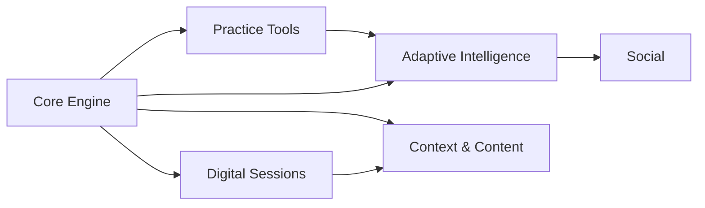

# Hifz World Map — Global Module Overview

> **What is this?** A high-level map of the entire Hifz module, broken into areas. Each area has its own mini roadmap with detailed tasks, user flows, and acceptance criteria. The [master roadmap](file:///c:/Users/khali/OneDrive/Bureau/Quran%20App/docs/features/hifz/hifz-roadmap.md) defines the phase-by-phase delivery order.

---

## Module Areas

```mermaid
graph TD
    A["🏠 Hifz Module"] --> B["⚙️ Core Engine"]
    A --> C["🃏 Practice Tools"]
    A --> D["📖 Context & Content"]
    A --> E["🖥️ Digital Sessions"]
    A --> F["🧠 Adaptive Intelligence"]
    A --> G["👥 Social & Accountability"]

    B --> B1["Profiles & Assessment"]
    B --> B2["Plan Generation"]
    B --> B3["Session Engine"]
    B --> B4["Progress Tracking"]
    B --> B5["Dashboard"]

    C --> C1["Flashcards (SRS)"]
    C --> C2["Mutashabihat"]

    D --> D1["Translations"]
    D --> D2["Tafsir"]
    D --> D3["Asbab al-Nuzul"]
    D --> D4["Surah Introductions"]

    E --> E1["Scoped Reading Canvas"]
    E --> E2["Session Overlays"]
    E --> E3["Mode Switching"]
    E --> E4["Verse-level Audio Sync"]

    F --> F1["Adaptive Calibration"]
    F --> F2["Smart Notifications"]
    F --> F3["Analytics & Reports"]

    G --> G1["Accountability Partners"]
    G --> G2["Teacher Mode"]
    G --> G3["Community Milestones"]
```

---

## Area Index

| Area | Mini Roadmap | Phases | Status |
|---|---|---|---|
| ⚙️ **Core Engine** | [core-engine-roadmap.md](file:///c:/Users/khali/OneDrive/Bureau/Quran%20App/docs/features/hifz/roadmaps/core-engine-roadmap.md) | Phase 1 | 🔧 In Progress |
| 🃏 **Practice Tools** | `roadmaps/practice-tools-roadmap.md` (TBD) | Phase 2 | ✅ V1 Done |
| 📖 **Context & Content** | `roadmaps/context-content-roadmap.md` (TBD) | Phase 3 | ⏳ Not Started |
| 🖥️ **Digital Sessions** | `roadmaps/digital-sessions-roadmap.md` (TBD) | Phase 4 | ⏳ Not Started |
| 🧠 **Adaptive Intelligence** | `roadmaps/adaptive-intelligence-roadmap.md` (TBD) | Phase 5 | ⏳ Not Started |
| 👥 **Social & Accountability** | `roadmaps/social-roadmap.md` (TBD) | Phase 6-7 | ⏳ Not Started |

---

## Cross-Area Dependencies

- **Core Engine** is the foundation — everything depends on it being solid first
- **Practice Tools** need session + progress data from Core Engine
- **Digital Sessions** extend the Core Engine's session model
- **Adaptive Intelligence** needs data from both Core Engine and Practice Tools
- **Context & Content** can start as soon as Core Engine is stable
- **Social** is the most independent — can be built last

---

## Key Documents

| Document | Path |
|---|---|
| Master Phase Roadmap | [hifz-roadmap.md](file:///c:/Users/khali/OneDrive/Bureau/Quran%20App/docs/features/hifz/hifz-roadmap.md) |
| User Flows (all 12+) | [user-flows.md](file:///c:/Users/khali/OneDrive/Bureau/Quran%20App/docs/features/hifz/user-flows.md) |
| Session UX Spec | [session-design.md](file:///c:/Users/khali/OneDrive/Bureau/Quran%20App/docs/features/hifz/methods-and-planning/session-design.md) |
| Plan Generation Pipeline | [plan-generation.md](file:///c:/Users/khali/OneDrive/Bureau/Quran%20App/docs/features/hifz/methods-and-planning/plan-generation.md) |
| Profile Data Model | [profile-model.md](file:///c:/Users/khali/OneDrive/Bureau/Quran%20App/docs/features/hifz/memory-profiles/profile-model.md) |
| Assessment Flow | [assessment-flow.md](file:///c:/Users/khali/OneDrive/Bureau/Quran%20App/docs/features/hifz/memory-profiles/assessment-flow.md) |
