# 🧭 User Flows — Complete Journey Map

> **Purpose:** Map every user journey through the app — from first launch to daily practice to long-term mastery.

---

## Target Audience

### Primary Personas

| Persona | Description | Primary Goal | Daily Time |
|---|---|---|---|
| **The Beginner** | Never memorized before. Wants to start with Juz 'Amma or short surahs | Learn their first juz | 15-30 min |
| **The Returnee** | Memorized as a child, lost it. Wants to rebuild | Recover + expand | 30-60 min |
| **The Committed Student** | Active hifz student, possibly with a teacher | Complete the Quran | 1-4 hours |
| **The Casual Reader** | Uses the app for reading/listening, not memorization | Read Quran daily | N/A (no hifz) |
| **The Parent** | Sets up profiles for children on a household device | Guide children's hifz | Varies |

---

## Navigation Map

```
┌─────────────────────────────────────────────────────┐
│                    APP SHELL                         │
│                                                     │
│  ┌──────────┬──────────┬──────┬────────┬─────────┐  │
│  │Dashboard │ Practice │ Read │ Listen │ Profile │  │
│  │   🏠     │    🃏    │  📖  │   🎧   │   👤    │  │
│  └──────────┴──────────┴──────┴────────┴─────────┘  │
│       │           │         │       │        │      │
│       ▼           ▼         ▼       ▼        ▼      │
│   Today's     Flashcards  Reading  Audio   Settings │
│   Plan        Mutashabihat Screen  Library Profiles │
│   Progress    Stats       Surah    Reciter  Theme   │
│   Session               Index    Browse   About    │
│   Entry                                            │
└─────────────────────────────────────────────────────┘
```

---

## Flow 1: First Launch

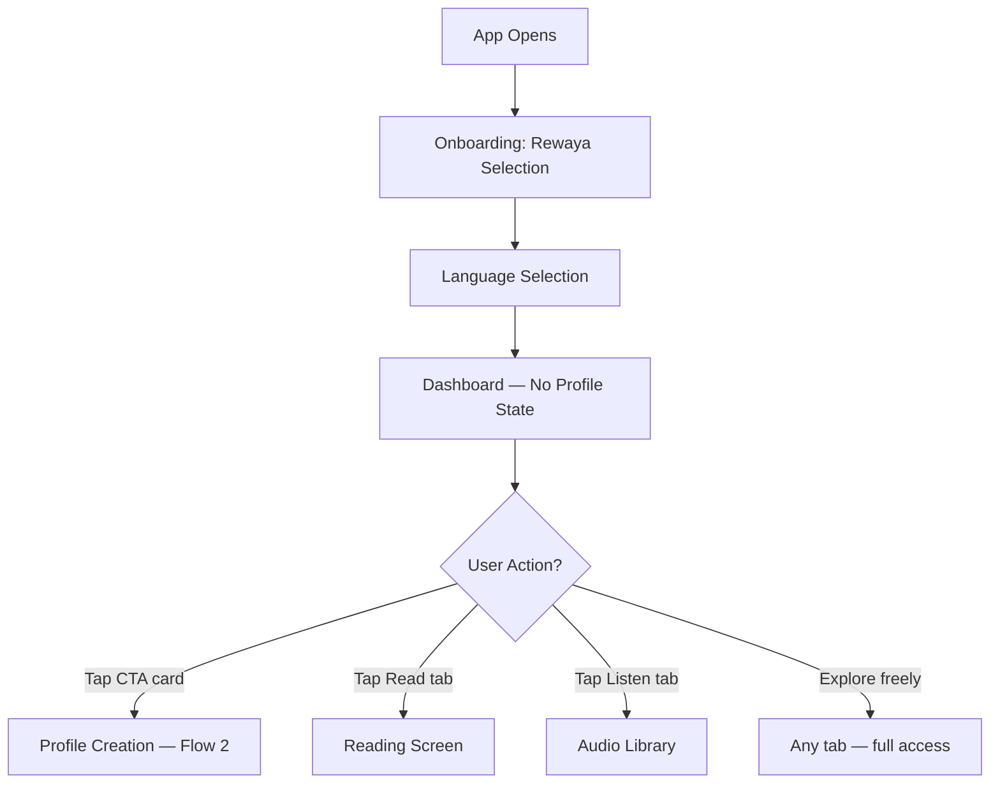

**Key decisions reflected:**
- Rewaya + language onboarding stays (existing feature)
- Profile creation is **optional** — user can explore first
- Dashboard shows CTA card inviting profile creation
- All app features accessible without a hifz profile

---

## Flow 2: Profile Creation (Assessment)

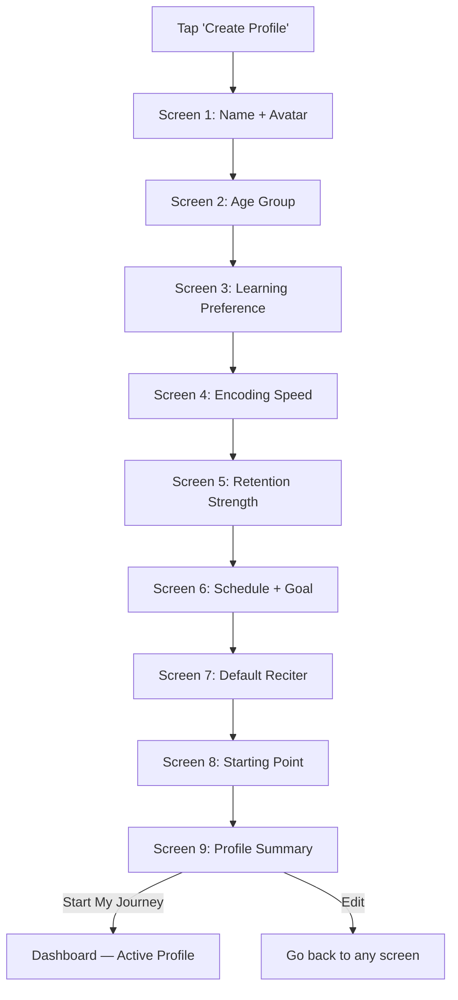

### Screen 8 (New): Starting Point
```
┌────────────────────────────────────────┐
│  Where would you like to start?        │
│                                        │
│  ⭐ Juz 30 (Juz 'Amma)               │
│     Most common starting point         │
│                                        │
│  ⭐ Surah Al-Baqarah                  │
│     Start from the beginning           │
│                                        │
│  🔍 Browse Surahs                      │
│  📄 Pick a Page                        │
│                                        │
│  💡 Based on your profile, we suggest  │
│     starting with Juz 'Amma            │
└────────────────────────────────────────┘
```

### Screen 9: Summary (Updated from assessment-flow.md)
Shows: name, avatar, 2-axis memory chart, framework parameters (daily load, reps, time distribution), estimated timeline, starting point.

**After creation:** Dashboard immediately shows today's first plan.

---

## Flow 3: Daily Dashboard Experience

The dashboard is the heart of the app. Every day, the user opens the app and sees:

### With Active Profile

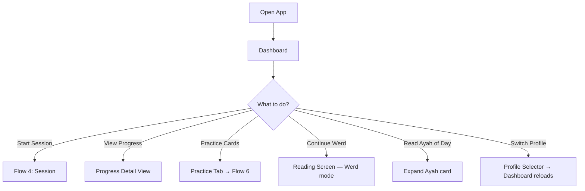

#### Dashboard Cards (Top to Bottom)

| Card | Content | Action |
|---|---|---|
| **Today's Plan** | Sabaq assignment, Sabqi pages, Manzil rotation, cards due | Tap → Pre-session screen |
| **Progress** | Current juz %, pages memorized count, active day streak | Tap → Progress detail |
| **Werd** | Daily reading goal progress (separate from hifz) | Tap → Reading screen |
| **Ayah of the Day** | Random verse with translation | Expandable |

### Without Profile (New User or Casual Reader)

| Card | Content |
|---|---|
| **CTA: Start Your Hifz Journey** | Invites profile creation, shows benefits |
| **Werd** | Daily reading goal |
| **Ayah of the Day** | Same as above |

---

## Flow 4: Hifz Session (Core Experience)

This is the most critical flow — what the user does every day.

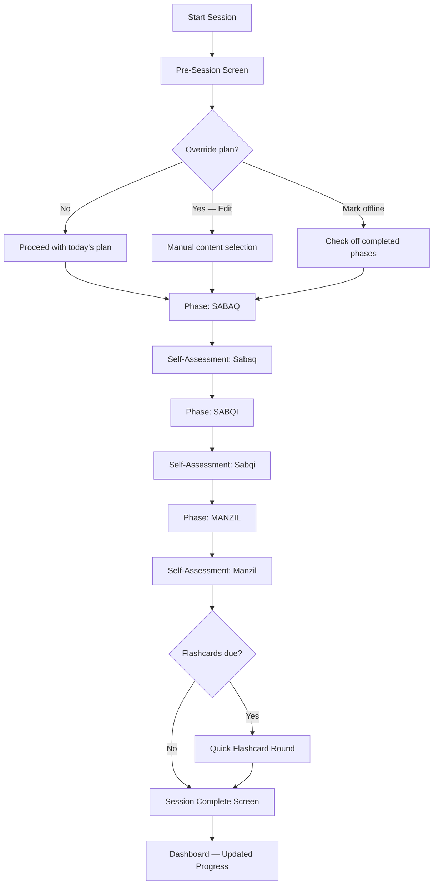

### Pre-Session Screen
```
┌────────────────────────────────────────┐
│  Today's Plan            Wed, Mar 20   │
│                          [Edit ✎]      │
│                                        │
│  📖 Sabaq:  Page 45 · Al-Baqarah      │
│     Lines 1-8 · ~25 min               │
│                                        │
│  🔄 Sabqi:  Pages 40-44               │
│     Last 5 days · ~15 min             │
│                                        │
│  📚 Manzil: Juz 30 · Pages 582-587   │
│     Rotation day 3/20 · ~15 min       │
│                                        │
│  🃏 Cards:  12 due · ~5 min           │
│                                        │
│  ── Already done offline? ──           │
│  ☐ Sabaq  ☐ Sabqi  ☐ Manzil  ☐ All   │
│                                        │
│  ⏱ Total estimated: ~60 min           │
│                                        │
│       [ Start Session ▶ ]              │
└────────────────────────────────────────┘
```

### During Session — Physical Quran Mode

```
┌────────────────────────────────────────┐
│  SABAQ · Page 45 · Al-Baqarah    1/3  │
│  ─────────────────────────────────     │
│                                        │
│                                        │
│            ⏱  12:32                    │
│                                        │
│        Repetition: 7 / 10             │
│                                        │
│        ┌─────────────┐                 │
│        │    + REP     │                │
│        └─────────────┘                 │
│                                        │
│                                        │
│  ◀◀  ▶ Play Audio  ▶▶   🔁 Loop       │
│  ─────────────────────────────────     │
│                                        │
│  [ ⏭ Skip ]            [ ✓ Done ]     │
└────────────────────────────────────────┘
```

**User actions during a phase:**
| Action | How |
|---|---|
| Count a repetition | Tap "+ REP" button |
| Play audio for assigned content | Tap play — audio starts at the correct verse |
| Loop audio | Toggle 🔁 — replays the assigned section |
| Skip this phase | Tap "Skip" — moves to next phase |
| Mark as done | Tap "Done" → triggers self-assessment |
| End session early | Back button / swipe → "End session?" confirmation |
| Increase time | Just keep going — timer counts up, no hard limit |
| Switch to digital | Menu option → reading canvas with assigned content |
| Change playback speed | Audio controls: 0.75x / 1.0x / 1.25x |

### Self-Assessment (After Each Phase)

```
┌────────────────────────────────────────┐
│                                        │
│  How did your Sabaq go?                │
│                                        │
│  ┌────────────────────────────┐        │
│  │  😊  Strong                │        │
│  │  I can recite fluently     │        │
│  └────────────────────────────┘        │
│  ┌────────────────────────────┐        │
│  │  😐  Okay                  │        │
│  │  Some hesitation           │        │
│  └────────────────────────────┘        │
│  ┌────────────────────────────┐        │
│  │  😟  Needs Work            │        │
│  │  I need more time          │        │
│  └────────────────────────────┘        │
│                                        │
│       [ Continue to Sabqi → ]          │
└────────────────────────────────────────┘
```

Feeds into: SRS intervals, adaptive calibration, flashcard priority.

### Session Complete

```
┌────────────────────────────────────────┐
│          ✨ Session Complete            │
│                                        │
│  📖 Sabaq:   Page 45 ✓  (Strong)      │
│  🔄 Sabqi:   5 pages ✓  (Okay)        │
│  📚 Manzil:  6 pages ✓  (Strong)      │
│  🃏 Cards:   12/12 ✓                   │
│                                        │
│  ⏱ Total: 58 min                      │
│  🔥 Day 14 active                      │
│                                        │
│  ┌──────────────────────────────┐      │
│  │  Tomorrow's preview:         │      │
│  │  📖 Page 46 · 🔄 Pages 41-45│      │
│  └──────────────────────────────┘      │
│                                        │
│       [ Back to Dashboard ]            │
└────────────────────────────────────────┘
```

---

## Flow 5: Plan Override

When the user's real day doesn't match the plan:

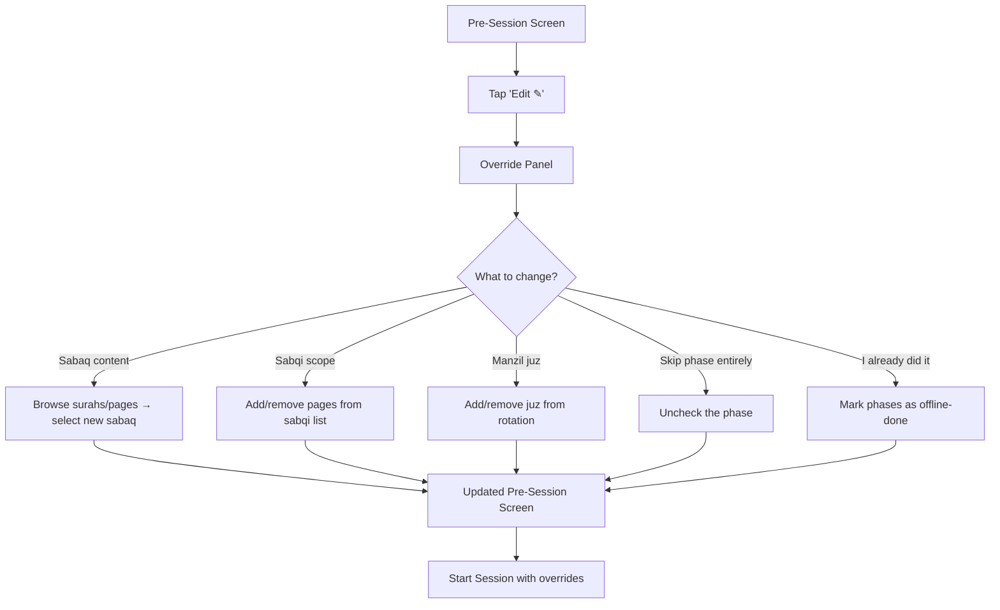

### "I Already Did This" Logic
- If Sabaq marked done → skip to Sabqi
- If Sabqi + Manzil marked done → show only Flashcards (or session complete)
- If all marked done → "Great! Everything's done for today. Want to do extra review?"
- System trusts the user — no verification

### Missed Days
When the user opens the app after missing a day (or multiple):
```
┌────────────────────────────────────────┐
│  Welcome back! 🌟                      │
│                                        │
│  You've been away for 3 days.          │
│  No worries — let's ease back in.      │
│                                        │
│  Today's suggestion:                   │
│  🔄 Review-only session (no new pages) │
│  📚 Manzil: Juz 30, 6 pages           │
│                                        │
│  [ Accept Suggestion ]                 │
│  [ Start Normal Plan Instead ]         │
│  [ Customize Today's Plan ]            │
└────────────────────────────────────────┘
```

- **Never guilt.** Language is warm and encouraging.
- Suggests review-only for 1-2 days before resuming new material
- User can override and continue normally

---

## Flow 6: Practice (Flashcards + Mutashabihat)

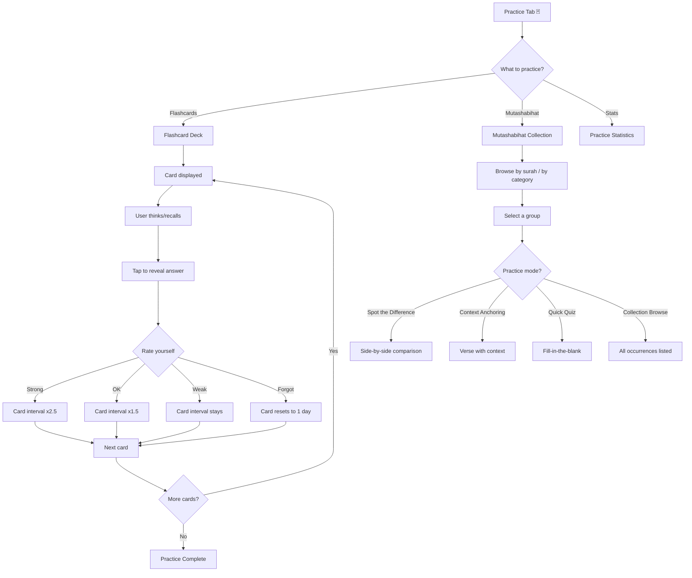

### Practice Tab Layout
```
┌────────────────────────────────────────┐
│  Practice                              │
│                                        │
│  ┌──────────────────────────────┐      │
│  │  🃏 Flashcards              │       │
│  │  12 cards due today          │      │
│  │  [ Start Review → ]          │      │
│  └──────────────────────────────┘      │
│                                        │
│  ┌──────────────────────────────┐      │
│  │  📿 Mutashabihat            │       │
│  │  3 groups need practice      │      │
│  │  [ Practice → ]              │      │
│  └──────────────────────────────┘      │
│                                        │
│  ── Practice Statistics ──             │
│  Cards reviewed this week: 84          │
│  Accuracy: 78%                         │
│  Streak: 5 days                        │
│                                        │
│  ── Card Type Breakdown ──             │
│  Next Verse:      ████████░ 82%        │
│  Verse Completion: ██████░░ 72%        │
│  Mutashabihat:     █████░░░ 65%        │
└────────────────────────────────────────┘
```

---

## Flow 7: Progress Review

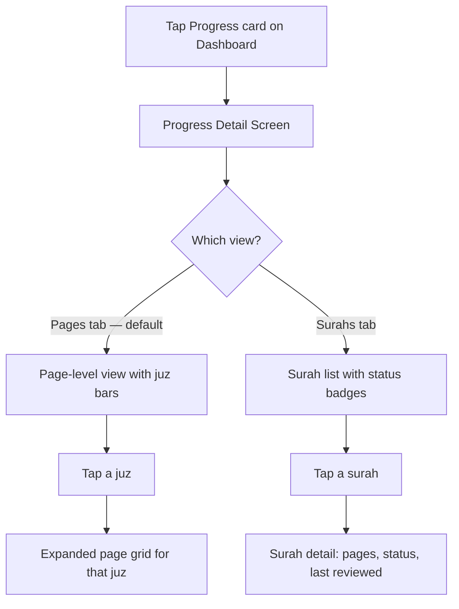

### Pages View (Default)
```
┌────────────────────────────────────────┐
│  Progress            [Pages] [Surahs]  │
│                                        │
│  Overall: 38/604 pages (6.3%)          │
│  ████░░░░░░░░░░░░░░░░░░░░░░░░░░░░     │
│                                        │
│  Juz 30  ████████████████████░  95%    │
│  Juz 29  ████████░░░░░░░░░░░░  40%    │
│  Juz 28  ░░░░░░░░░░░░░░░░░░░░   0%   │
│          ⋮                             │
│  Juz 1   ░░░░░░░░░░░░░░░░░░░░   0%   │
│                                        │
│  ── Quick Stats ──                     │
│  🔥 Active days: 14                    │
│  📅 Started: Feb 20, 2026             │
│  📈 Pace: 1.3 pages/week              │
│  🎯 Est. completion: Dec 2028         │
└────────────────────────────────────────┘
```

### Page Grid (Tap a Juz)
```
  🟢🟢🟢🟢🟢🟢🟢🟢🟢🟢
  🟢🟢🟢🟢🟢🟡🟡🟡🔵⚪
  ⚪⚪⚪⚪⚪⚪⚪⚪⚪⚪

  🟢 Memorized  🟡 Learning  🔵 Reviewing  ⚪ Not started
```

---

## Flow 8: Reading (Non-Hifz)

The Read tab works independently of the hifz program:

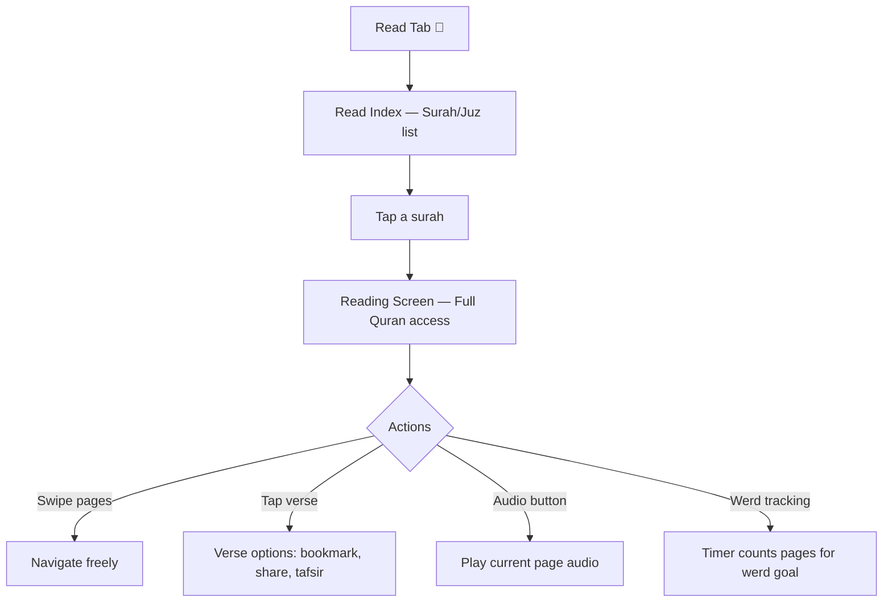

- **No restrictions** — full Quran access (unlike sessions which are scoped)
- Werd tracking continues to work as it does today
- Bookmarks, theme settings, all existing features preserved
- Audio playback available per page/chapter

---

## Flow 9: Listening (Non-Hifz)

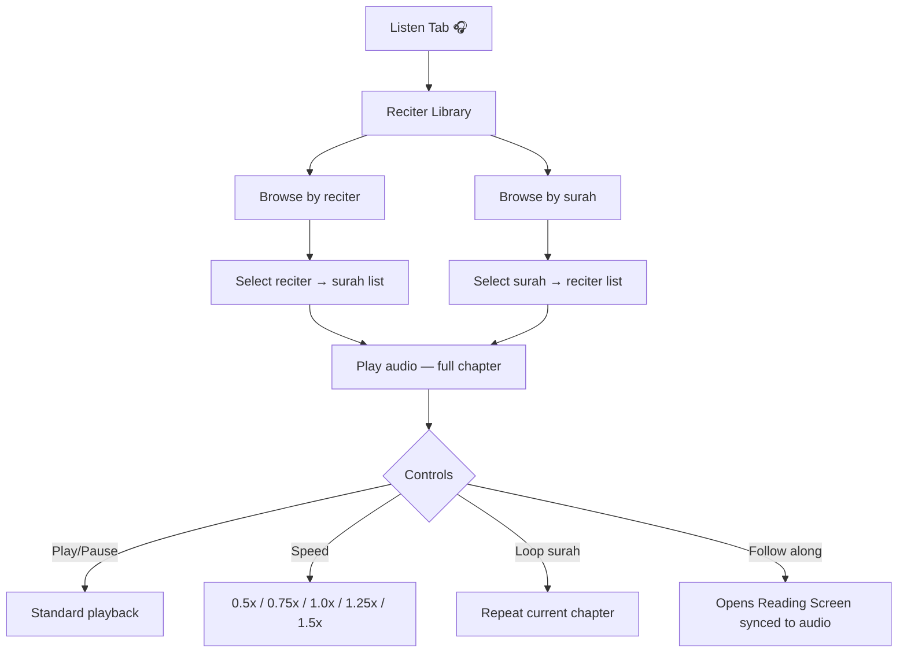

---

## Flow 10: Adaptive Suggestions

After the first week, the system begins observing patterns:

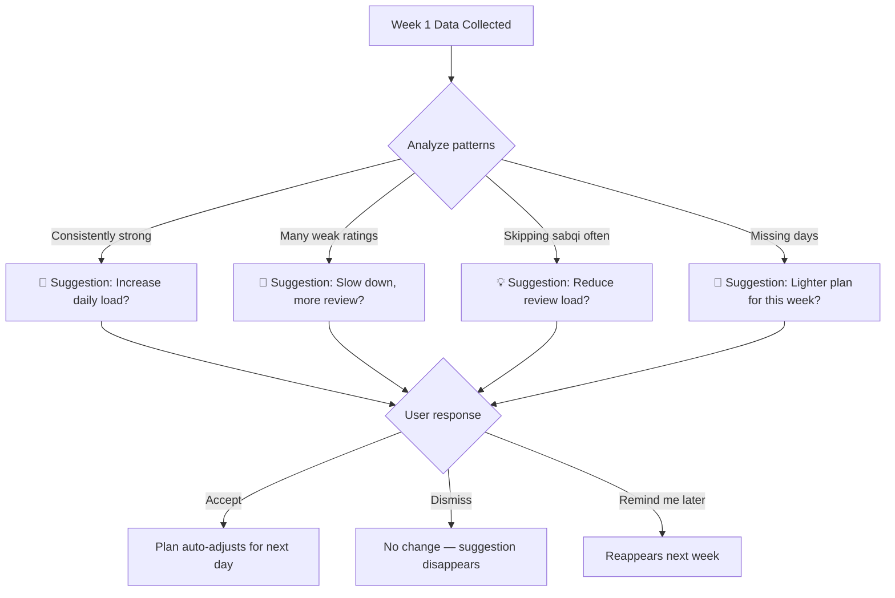

**Delivery:** Suggestions appear as a card on the dashboard, NOT as a modal/popup. Non-intrusive.

---

## Flow 11: Multiple Profiles

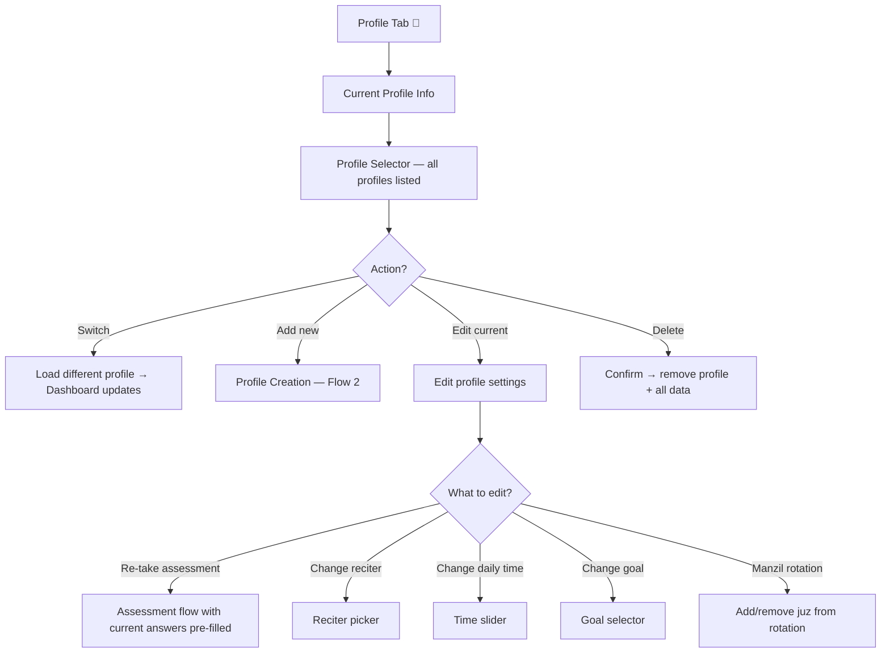

---

## Flow 12: Notification-Driven Session

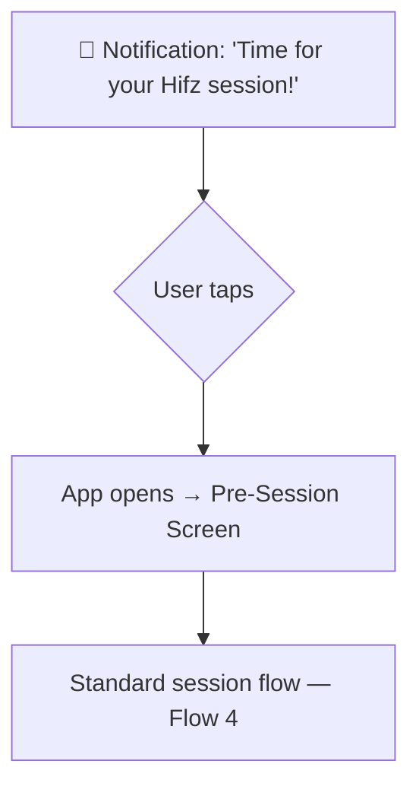

Notification preferences set in Profile:
- Time of day (matches `preferredTimeOfDay` from assessment)
- User can snooze or dismiss
- Smart: if session already completed today, no notification

---

## Daily Practice Rhythm

A typical day for the committed user:

```
6:00 AM  📱 Notification: "Time for Hifz"
6:05 AM  🏠 Open Dashboard → see today's plan
6:06 AM  📖 Start Session → Sabaq (25 min)
6:31 AM  🔄 Sabqi phase (15 min)
6:46 AM  📚 Manzil phase (15 min)
7:01 AM  🃏 Quick flashcards (5 min)
7:06 AM  ✨ Session Complete → Dashboard updated

... During the day ...

12:30 PM 🃏 Practice tab → review 10 more cards (commute/lunch)
9:00 PM  📖 Werd: read 3 pages casually (separate from hifz)
```

---

## Edge Cases

| Scenario | Handling |
|---|---|
| User memorized a surah before using the app | Profile setup → pick starting point; or mark pages as memorized manually in Progress view |
| User's teacher assigns different content | Override plan for the day — full flexibility |
| User wants to review a surah not in their manzil | Override → add it to today's session |
| User finishes the Quran | 🎉 Celebration screen → Plan shifts to full-time review mode |
| User reinstalls the app | SQLite data on device; future: cloud sync |
| Ramadan mode | Heavier manzil rotation (review entire Quran during Ramadan), lighter sabaq |
| Two profiles want different reciters | Each profile has independent reciter setting |
| Child profile | Shorter sessions, simpler language, more 🎉 celebrations |
